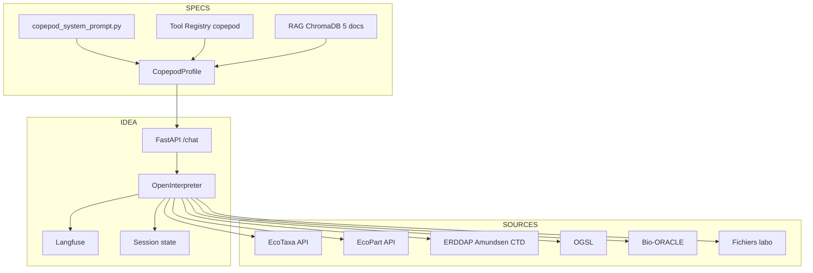
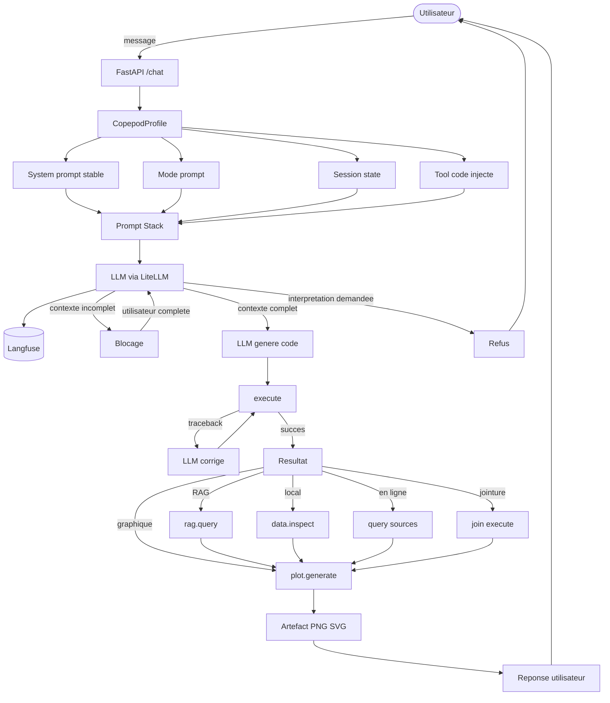
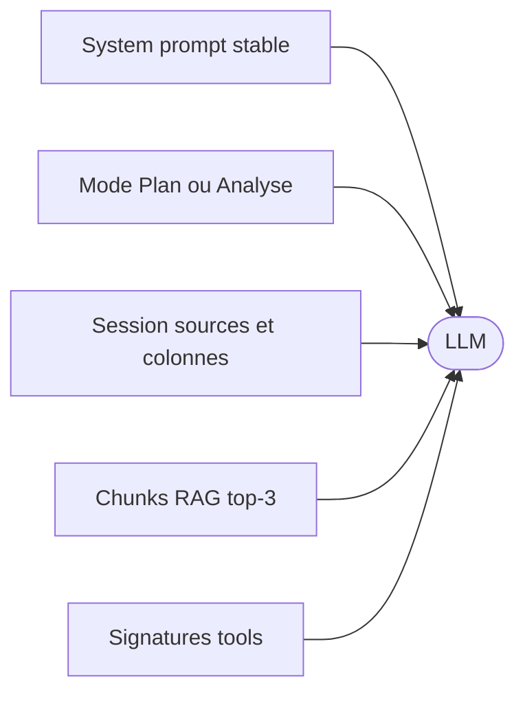
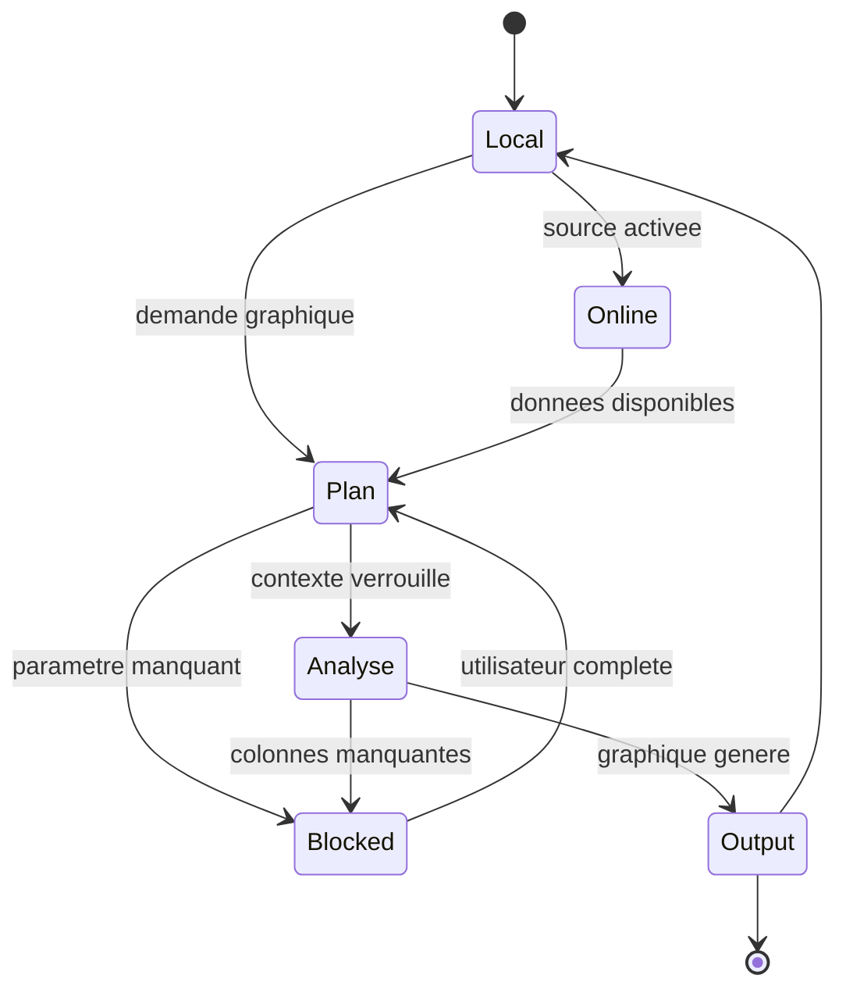
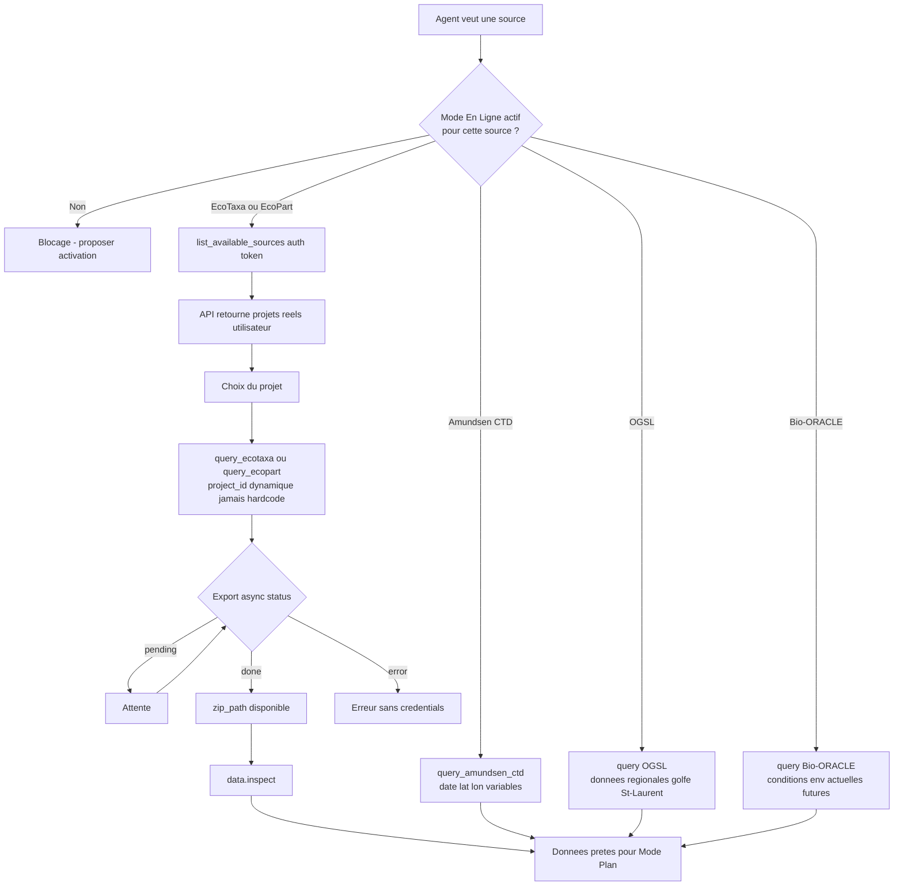

# ARCHITECTURE.md

---

## Vue d'ensemble

```mermaid
graph TB
    subgraph SPECS
        SP[copepod_system_prompt.py]
        TR[Tool Registry copepod]
        RAG[RAG ChromaDB 5 docs]
        CP[CopepodProfile]
    end

    subgraph IDEA
        API[FastAPI /chat]
        OI[OpenInterpreter]
        LF[Langfuse]
        SESSION[Session state]
    end

    subgraph SOURCES
        ET[EcoTaxa API]
        EP[EcoPart API]
        AM[ERDDAP Amundsen CTD]
        OGSL[OGSL]
        BIO[Bio-ORACLE]
        LAB[Fichiers labo]
    end

    SP --> CP
    TR --> CP
    RAG --> CP
    CP --> API
    API --> OI
    OI --> LF
    OI --> SESSION
    OI --> ET
    OI --> EP
    OI --> AM
    OI --> OGSL
    OI --> BIO
    OI --> LAB
```

---

## Parcours input vers output

```mermaid
graph TD
    U([Utilisateur]) -->|message| API[FastAPI /chat]
    API --> CP[CopepodProfile]

    CP --> SYS[System prompt stable]
    CP --> MODE[Mode prompt]
    CP --> STATE[Session state]
    CP --> TINJ[Tool code injecte]

    SYS --> STACK[Prompt Stack]
    MODE --> STACK
    STATE --> STACK
    TINJ --> STACK

    STACK --> LLM[LLM via LiteLLM]
    LLM --> LF[(Langfuse)]

    LLM -->|contexte incomplet| BLOCK[Blocage]
    BLOCK -->|utilisateur complete| LLM
    LLM -->|contexte complet| CODE[LLM genere code]

    CODE --> RUN[execute]
    RUN -->|traceback| FIX[LLM corrige]
    FIX --> RUN
    RUN -->|succes| RESULT[Resultat]

    RESULT -->|RAG| RAGQ[rag.query]
    RESULT -->|local| DINSP[data.inspect]
    RESULT -->|en ligne| SRC[query sources]
    RESULT -->|jointure| JOIN[join execute]
    RESULT -->|graphique| PLOT[plot.generate]

    RAGQ --> PLOT
    DINSP --> PLOT
    SRC --> PLOT
    JOIN --> PLOT

    PLOT --> ART[Artefact PNG SVG]
    ART --> OUT[Reponse utilisateur]
    OUT --> U

    LLM -->|interpretation demandee| REFUSE[Refus]
    REFUSE --> U
```

---

## Prompt Stack

```mermaid
graph LR
    SYS[System prompt stable] --> LLM([LLM])
    MODE[Mode Plan ou Analyse] --> LLM
    STATE[Session sources et colonnes] --> LLM
    CHUNKS[Chunks RAG top-3] --> LLM
    SIGS[Signatures tools] --> LLM
```

---

## Modes

```mermaid
stateDiagram-v2
    [*] --> Local
    Local --> Plan : demande graphique
    Local --> Online : source activee
    Online --> Plan : donnees disponibles
    Plan --> Blocked : parametre manquant
    Plan --> Analyse : contexte verrouille
    Blocked --> Plan : utilisateur complete
    Analyse --> Output : graphique genere
    Analyse --> Blocked : colonnes manquantes
    Output --> Local
    Output --> [*]
```

---

## Acces sources en ligne

```mermaid
graph TD
    REQ[Agent veut une source] --> CHECK{Mode En Ligne actif\npour cette source ?}
    CHECK -->|Non| BLOQ[Blocage - proposer activation]

    CHECK -->|EcoTaxa ou EcoPart| LIST[list_available_sources auth token]
    LIST --> API2[API retourne projets reels utilisateur]
    API2 --> SELECT[Choix du projet]
    SELECT --> EXPORT[query_ecotaxa ou query_ecopart\nproject_id dynamique jamais hardcode]
    EXPORT --> JOB{Export async status}
    JOB -->|pending| WAIT[Attente]
    WAIT --> JOB
    JOB -->|done| ZIP[zip_path disponible]
    JOB -->|error| ERR[Erreur sans credentials]
    ZIP --> INSPECT[data.inspect]
    INSPECT --> READY[Donnees pretes pour Mode Plan]

    CHECK -->|Amundsen CTD| AM[query_amundsen_ctd\ndate lat lon variables]
    AM --> READY

    CHECK -->|OGSL| OG[query OGSL\ndonnees regionales golfe St-Laurent]
    OG --> READY

    CHECK -->|Bio-ORACLE| BO[query Bio-ORACLE\nconditions env actuelles futures]
    BO --> READY
```
