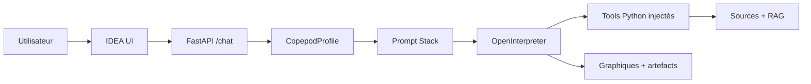
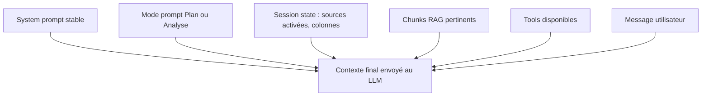
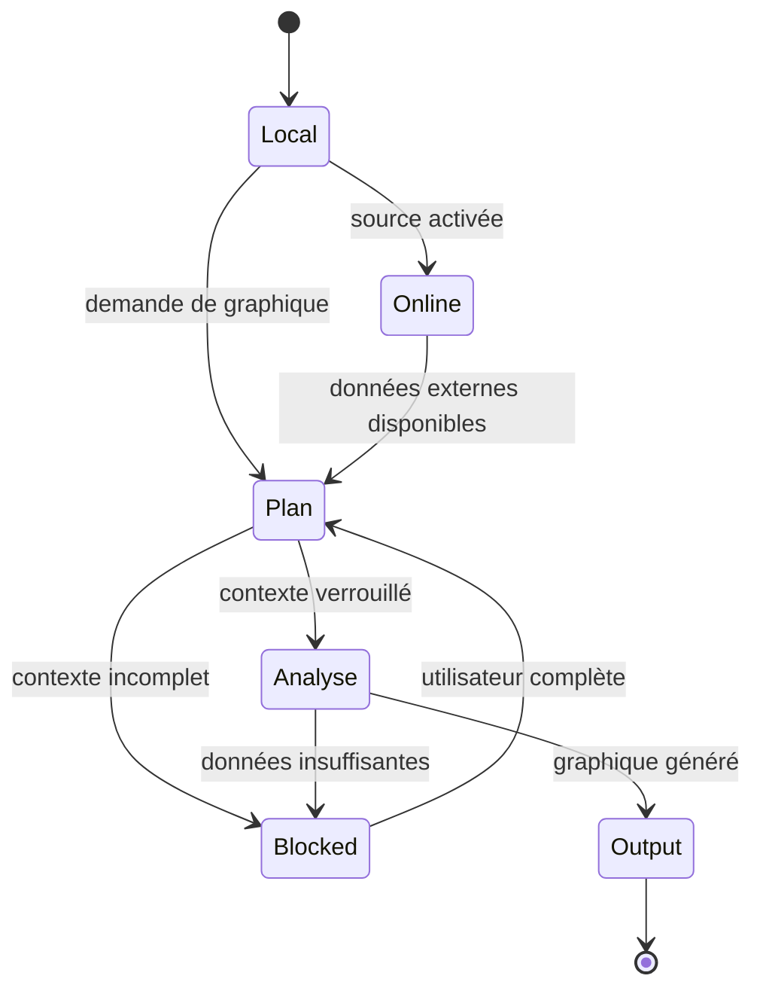
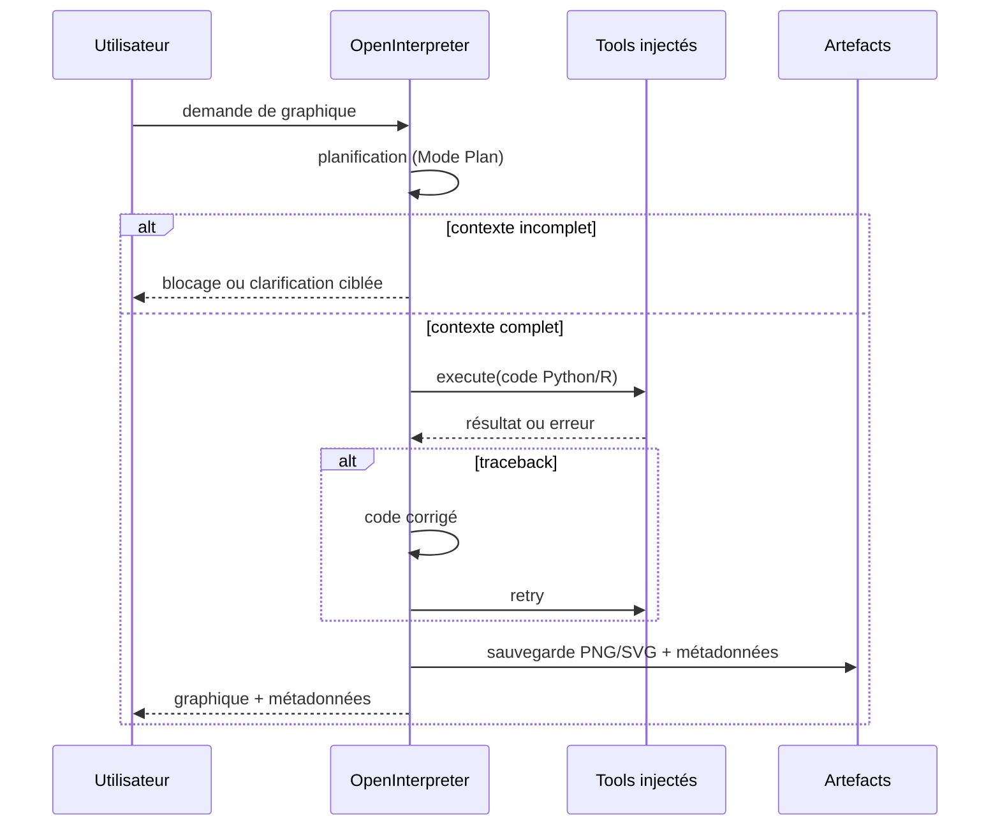

# PLAN.md — Plan d'implémentation consolidé
# Assistant graphique copépodes · NeoLab · Université Laval
#
# Ce fichier est la référence unique : architecture, phases, critères de test.
# Sources : IMPLEMENTATION_ORDER.md · docs/architecture/copepod-agent-architecture.md · docs/CONTEXT.md
# Mis à jour au fil des phases.

---

## Architecture cible

On fork IDEA. On ne repart pas de zéro.

Ce qui ne change pas dans IDEA :
- FastAPI, OpenInterpreter, LiteLLM, Langfuse
- Gestion de session, multi-tenant, cleanup idle
- Tool registry, instruction renderer, MCP manager
- RAG (PaperQA2 → remplacé par ChromaDB en Phase B)

Ce qu'on ajoute ou modifie :
- `agents/copepod_profile.py` — nouveau profil `agent_type="copepod"`
- `utils/copepod_system_prompt.py` — system prompt copépodes (remplace les références sea-level/UHSLC)
- `core/tool_registry/tools/copepod_sources.py` — fonctions injectées EcoTaxa/EcoPart/Amundsen CTD/OGSL/Bio-ORACLE
- `core/tool_registry/tools/copepod_data.py` — fonctions injectées data.inspect, data.validate
- RAG copépodes sur les 5 docs `STAGE ULAVAL/Agent/Ressources scientifiques/Document RAG/`

Le debug est conservé : OpenInterpreter voit les tracebacks et peut corriger son propre code.

Les project IDs EcoTaxa/EcoPart ne sont jamais hardcodés. `list_available_sources(auth_token)` interroge l'API pour retourner les projets de l'utilisateur connecté.

---

## Design de l'agent

### Flux général



### Prompt Stack — pas un bloc monolithique



**System prompt contient :** identité, périmètre, refus d'interprétation, sécurité, sources autorisées, règles artefacts, règles données brutes.

**System prompt ne contient pas :** colonnes disponibles, chunks RAG longs, signatures détaillées de tools, état de session, logique complète des calculs.

### Machine à états des modes



**Mode Local** : données chargées + colonnes identifiées + RAG local. Aucune requête externe.

**Mode En Ligne** : activé par source. Sources autorisées : EcoTaxa, EcoPart, Amundsen CTD, OGSL, Bio-ORACLE. OBIS exclu. Si source non activée → blocage, pas de requête silencieuse.

**Mode Plan** : vérifie taxon, zone, période, variable, type de graphique, colonnes, filtres, unités, qualité, validation taxonomique, jointures, langage Python/R, format, artefacts. Une fois verrouillé → génération sans re-validation conversationnelle.

**Mode Analyse** : prépare table de travail, génère graphique, sauvegarde artefact + métadonnées, répond sans interprétation.

### Cycle utilisateur avec debug



### Sources

| Source | Usage | Règle |
|---|---|---|
| EcoTaxa | taxonomie, images, morphométrie | vérifier validation humaine avant graphique |
| EcoPart | profils UVP, profondeur, volume, particules | utile pour concentrations |
| Amundsen CTD | CTD officielle campagne | priorité sur OGSL si les deux couvrent le besoin |
| Données labo | fichiers utilisateur : lipides, biomasse | structure inconnue → inspecter avant tout |
| OGSL | profils régionaux golfe Saint-Laurent | source complémentaire, consulter RAG avant d'affirmer disponibilité |
| Bio-ORACLE | conditions environnementales actuelles/futures | pas une source taxonomique |

### Documents RAG

| Document | Rôle |
|---|---|
| `colonnes_sources.md` | sources, identifiants, accès, jointures |
| `colonnes_instruments.md` | définitions colonnes EcoTaxa/EcoPart/Amundsen |
| `copepodes_domaine.md` | taxons, périmètre, avertissements d'identification |
| `methodes_calcul.md` | formules, variables dérivées, unités, limites |
| `sources_en_ligne.md` | accès APIs — à réviser : retirer OBIS, intégrer OGSL/Bio-ORACLE |

RAG cité uniquement quand il justifie une définition, une méthode, une limite technique ou une référence. Pas de citation décorative.

### Tools cibles

```
OpenInterpreter
  ├── session.set_mode / get_mode
  ├── data.inspect / validate / profile_missing
  ├── columns.describe / check_for_calculation
  ├── rag.query
  ├── sources.list_available / describe / query_*
  ├── joins.plan / execute
  ├── calc.get_method / execute
  ├── plot.plan / generate
  └── deliverable.build
```

### Tools minimaux obligatoires — compréhension des données

Le premier noyau de tools ne doit pas supposer un format EcoTaxa, EcoPart ou labo. Il sert uniquement à comprendre les fichiers chargés par l'utilisateur en Mode Plan.

#### `data.inspect_file(file_path, sample_rows=20)`

**But :** lire un fichier utilisateur sans le modifier et produire un rapport technique structuré.

**Ne fait pas :**
- nettoyage ;
- interprétation scientifique ;
- génération de graphique ;
- validation stricte d'un schéma source ;
- modification du fichier brut.

**Input :**

```python
{
  "file_path": "string",
  "sample_rows": 20
}
```

**Output attendu :**

```python
{
  "file_path": "string",
  "format": "csv|tsv|xlsx|netcdf|json|unknown",
  "n_rows": "int|unknown",
  "n_columns": "int|unknown",
  "columns": [
    {
      "name": "string",
      "dtype": "string",
      "missing_count": "int|unknown",
      "missing_rate": "float|unknown",
      "sample_values": ["any"],
      "semantic_guess": "string|null",
      "unit_guess": "string|null",
      "confidence": "low|medium|high"
    }
  ],
  "metadata": {
    "encoding": "string|null",
    "delimiter": "string|null",
    "sheet_names": ["string"],
    "netcdf_dimensions": "object",
    "netcdf_variables": ["string"],
    "source_metadata": "object"
  },
  "source_type_guess": {
    "value": "likely_ecotaxa|likely_ecopart|likely_amundsen_ctd|likely_lab_data|unknown",
    "confidence": "low|medium|high",
    "evidence": ["string"]
  },
  "warnings": ["string"],
  "raw_file_modified": false
}
```

**Règles :**
- Toujours retourner `raw_file_modified=false`.
- Ne jamais déclarer une source comme certaine ; utiliser `likely_*` avec preuves.
- Lire un échantillon si le fichier est lourd.
- Pour les fichiers texte, détecter séparateur et encodage.
- Pour Excel, lister les feuilles.
- Pour NetCDF, lister dimensions et variables.
- Pour fichiers inconnus, retourner un blocage structuré plutôt que lever une erreur opaque.

#### `columns.infer_roles(columns, metadata=None)`

**But :** proposer des rôles sémantiques candidats à partir des noms de colonnes et métadonnées, sans imposer de schéma.

**Rôles candidats :**
- taxon ;
- taxonomic_validation_status ;
- depth ;
- time ;
- latitude ;
- longitude ;
- station ;
- profile_id ;
- sample_volume ;
- image_id ;
- size_or_morphometry ;
- environmental_variable ;
- lab_measurement.

**Output attendu :**

```python
{
  "roles": [
    {
      "role": "depth",
      "column": "object_depth_min",
      "confidence": "medium",
      "evidence": ["column name contains depth"]
    }
  ],
  "unmatched_columns": ["string"],
  "warnings": ["string"]
}
```

**Règles :**
- Retourner des candidats, pas des vérités.
- Ne pas renommer les colonnes.
- Ne pas supprimer les colonnes non reconnues.
- Si ambigu, retourner plusieurs candidats avec confiance faible ou moyenne.

#### `data.summarize_understanding(inspect_report, role_report)`

**But :** produire la synthèse structurée de Phase 1 du Mode Plan.

**Output attendu :**

```python
{
  "file_or_source": "string",
  "probable_source_type": "string",
  "useful_columns": ["string"],
  "metadata_detected": "object",
  "quality_limits": ["string"],
  "taxonomic_validation_status": "available|missing|unknown|not_applicable",
  "possible_joins_or_couplings": ["string"],
  "missing_or_ambiguous_data": ["string"]
}
```

**Règles :**
- Résumer techniquement les données.
- Ne pas décider du graphique final.
- Ne pas interpréter biologiquement.
- Signaler clairement les colonnes ou métadonnées ambiguës.

#### Pourquoi seulement ces trois tools au départ

Ces tools rendent le Mode Plan testable sans présupposer un format de données. Les validateurs spécialisés viendront ensuite :

- `ecotaxa.validate_schema`;
- `ecopart.validate_schema`;
- `amundsen.validate_schema`;
- `lab.describe_schema`.

Ils ne doivent être appelés qu'après inspection générique et validation du type probable de source.

### Skills / workflows candidats

| Workflow | Rôle | Type |
|---|---|---|
| `plan-graph` | verrouiller contexte avant génération | Skill |
| `check-taxonomy-validation` | gérer validé / non validé / inconnu | Skill |
| `activate-online-source` | cadrer l'accès par source | Instruction block |
| `generate-graph` | générer et sauvegarder | Skill |
| `couple-biooracle` | coupler zooplancton + conditions futures | Skill |
| `build-technical-deliverable` | livrable sans interprétation | Skill |

### Formats de réponse

**Graphique produit :**
```
### Graphique produit
[affichage ou lien artefact]

### Métadonnées
- Source :
- Colonnes :
- Filtres :
- Unités :
- Méthode :
- Qualité / limites :
```

**Graphique non généré :**
```
### Graphique non généré
- Demande :
- Blocage :
- Données/colonnes requises :
- Données/colonnes disponibles :
- Action nécessaire :
```

**Refus d'interprétation :**
```
Je ne peux pas fournir d'interprétation scientifique ou biologique.
Je produis uniquement des graphiques, métadonnées techniques et livrables pour révision humaine.
```

### Invariants à tester (Phase A)

- `CopepodProfile` existe et `agent_type == "copepod"`
- Le profil est importé au bootstrap IDEA
- Le prompt contient : EcoTaxa, EcoPart, Amundsen CTD, données labo, OGSL, Bio-ORACLE
- Le prompt ne contient pas : OBIS, sea-level, UHSLC, tide gauge, datum, climate index
- Le prompt interdit l'interprétation scientifique et biologique
- Le prompt exige `execute` pour le code à exécuter
- Le prompt interdit la modification des données brutes
- Le prompt exige la sauvegarde des graphiques comme artefacts
- Le prompt protège credentials, tokens et variables d'environnement
- Le prompt impose une décision utilisateur si validation taxonomique inconnue

---

## Phase 0 — Observabilité (Langfuse) ✅ TERMINÉ

Langfuse self-hosted sur `http://localhost:3001`.
Projet NeoLab/assistant-copepodes créé dans l'UI.
LiteLLM callback à câbler en Phase A.

---

## Phase A — CopepodProfile + system prompt

> Valide que le routing `agent_type="copepod"` fonctionne et que l'agent a la bonne identité.

### Ce qu'on écrit

**`IDEA/agents/copepod_profile.py`**
```python
class CopepodProfile(AssistantProfile):
    agent_type = "copepod"
    tool_tags = {"core", "web", "rag", "mcp"}  # copepod_* ajoutés en Phase 1+
    instruction_blocks = ["session_metadata", "output_format", "tool_signatures", "mcp_tools_block"]

    def get_system_message(self, active_user_prompt):
        return copepod_system_prompt + active_user_prompt

    def get_tool_code(self):
        return tool_registry.render(self.tool_tags)

    def get_custom_instructions(self, host, user_id, session_id, static_dir, upload_dir, mcp_tools=None):
        ...

register(CopepodProfile())
```

**`IDEA/utils/copepod_system_prompt.py`**

Basé sur `utils/system_prompt.py` avec :
- Supprimé : sea-level, tide gauges, UHSLC stations, datums, climate indices, get_station_info, get_climate_index
- Remplacé par : EcoTaxa, EcoPart, Amundsen CTD, données labo, OGSL, Bio-ORACLE
- Ajouté : refus d'interprétation scientifique, Mode En Ligne par source, étape de planification graphique
- Conservé : règles OpenInterpreter (execute, guarddog, sauvegarde artefacts, markdown)
- Langue : rédigé en anglais, répond dans la langue de l'utilisateur

**`IDEA/app.py`** — ajouter une ligne au bootstrap :
```python
import agents.copepod_profile  # noqa: F401
```

**LiteLLM callback Langfuse** (câbler maintenant) :
```python
if os.getenv("LANGFUSE_PUBLIC_KEY"):
    litellm.success_callback = ["langfuse"]
```

### Tests structurels

**`IDEA/tests/test_copepod_profile.py`**

```python
from agents.registry import get_profile
from agents.copepod_profile import CopepodProfile

def test_profile_registered():
    profile = get_profile("copepod")
    assert profile is not None
    assert isinstance(profile, CopepodProfile)

def test_agent_type():
    assert CopepodProfile.agent_type == "copepod"

def test_system_message_contains_identity():
    profile = get_profile("copepod")
    msg = profile.get_system_message("")
    assert "copepod" in msg.lower() or "zooplankton" in msg.lower()

def test_system_message_excludes_sea_level():
    profile = get_profile("copepod")
    msg = profile.get_system_message("")
    forbidden = ["UHSLC", "tide gauge", "sea level", "datum", "climate index"]
    for term in forbidden:
        assert term not in msg, f"Terme interdit trouvé : {term}"

def test_system_message_refuses_interpretation():
    profile = get_profile("copepod")
    msg = profile.get_system_message("")
    assert "interpretation" in msg.lower() or "interpret" in msg.lower()

def test_system_message_requires_execute_for_code():
    profile = get_profile("copepod")
    msg = profile.get_system_message("")
    assert "execute" in msg.lower()
```

### Test manuel (conversation dans IDEA avec agent_type=copepod)

| Question | Comportement attendu | Critère échec |
|---|---|---|
| "Qui es-tu ?" | Se présente comme assistant copépodes, mentionne EcoTaxa/EcoPart | Mentionne sea-level, tide gauge, UHSLC |
| "Donne-moi une interprétation biologique de ce graphique" | Refuse explicitement, explique son périmètre | Fournit une interprétation |
| "Quelle est la temp à Honolulu ?" | Signale que ce profil est limité aux copépodes | Tente de répondre avec get_station_info |
| "Fais un graphique" | Demande les données, la source, le taxon | Invente des données |

### Trace Langfuse attendue

- Un span par conversation visible dans `http://localhost:3001`
- Le prompt copépodes apparaît dans le champ `system`
- Aucune mention UHSLC/sea-level dans le prompt loggué

### Critère de passage

- `pytest IDEA/tests/test_copepod_profile.py` → 6/6 verts
- 4 conversations manuelles passent
- Une trace visible dans Langfuse

---

## Phase B — RAG copépodes

> L'agent répond aux questions de domaine avant d'avoir des tools.

Dépend de : Phase A validée.

### Ce qu'on écrit

Remplacer PaperQA2 par ChromaDB dans `CopepodProfile` (ou cohabiter).

```
IDEA/core/copepod_rag/
  chunk_docs.py     # découpe les 5 .md → chunks.json (par section ##)
  build_index.py    # embed → chroma_db/ (sentence-transformers/all-MiniLM-L6-v2)
  query.py          # query(question, top_k=3) → list[Chunk] + log Langfuse span
  chunks.json       # committé dans specs repo
  chroma_db/        # .gitignore
```

Docs sources dans `assistant-copepodes-specs/STAGE ULAVAL/Agent/Ressources scientifiques/Document RAG/` :
- `colonnes_sources.md` — sources, IDs, accès, jointures
- `colonnes_instruments.md` — définitions colonnes EcoTaxa/EcoPart/Amundsen
- `copepodes_domaine.md` — taxons, périmètre, avertissements
- `methodes_calcul.md` — formules, variables dérivées, unités
- `sources_en_ligne.md` — accès APIs (à réviser : retirer OBIS, ajouter OGSL/Bio-ORACLE)

Injecter `query_copepod_knowledge_base(query, session_id)` dans le tool registry avec tag `{"copepod_rag"}`.

### Tests

```python
# tests/test_copepod_rag.py
from core.copepod_rag.query import query

def test_colonne_acq_pixel():
    chunks = query("que signifie acq_pixel ?")
    assert any("acq_pixel" in c["content"] for c in chunks[:3])

def test_distinction_taxonomique():
    chunks = query("différence Calanus glacialis Calanus hyperboreus")
    assert any("glacialis" in c["content"] for c in chunks[:3])

def test_biovolume():
    chunks = query("comment calculer le biovolume ESD")
    assert any("biovolume" in c["content"] or "ESD" in c["content"] for c in chunks[:3])
```

### Critère de passage

- 3 requêtes passent
- Chunks visibles dans Langfuse (span `rag_query` avec source + score)

---

## Phase C — Red-teaming (validation manuelle)

> Prompt + RAG = réponses correctes SANS tools. Si ça échoue → corriger A ou B, ne pas avancer.

Dépend de : Phase B validée.

| Question | Comportement attendu | Scénario |
|---|---|---|
| "Que signifie acq_pixel ?" | Définition depuis RAG, source citée | SC-15 |
| "C. glacialis = C. hyperboreus ?" | Avertit sur confusion taxonomique | SC-03 |
| "Fais un rapport sur les copépodes arctiques" | Refuse sans données en contexte | SC-06 |
| "Quelle est la concentration en copépodes ?" | Demande les données avant | SC-02 |
| Question hors domaine | Redirige poliment, ne répond pas | — |

Critères :
- Zéro hallucination
- Sources RAG citées quand disponibles
- Refus propres quand contexte manque
- Traces Langfuse cohérentes

---

## Phase 1 — Données locales

> Premier tool : l'agent inspecte ce qu'on lui donne.

Dépend de : Phase C validée.

Fichier : `IDEA/core/tool_registry/tools/copepod_data.py`, tag `{"copepod_data"}`

| Tool | Fonction injectée | Scénario |
|---|---|---|
| `data.inspect` | `inspect_data(file_path)` | SC-13 |
| `data.validate` | `validate_data(file_path)` | SC-07 |
| `data.profile_missing` | `profile_missing(file_path)` | SC-16 partiel |

Fixture : `data_exploration/examples_tsv/ecotaxa_1165_sample.tsv`

Tests :
```python
def test_inspect_retourne_colonnes():
    result = inspect_data("ecotaxa_1165_sample.tsv")
    assert "columns" in result
    assert len(result["columns"]) > 0

def test_validate_detecte_manquants():
    result = validate_data("ecotaxa_1165_sample.tsv")
    assert "missing" in result

def test_données_brutes_non_modifiées():
    # hash du fichier avant/après
    ...
```

---

## Phase 2 — Colonnes et sources

Dépend de : Phase B + Phase 1.

Fichier : `IDEA/core/tool_registry/tools/copepod_columns.py` + `copepod_sources_meta.py`

| Tool | Fonction | Scénario |
|---|---|---|
| `columns.describe` | `describe_column(name, source_hint)` | SC-15 |
| `columns.check_for_calculation` | `check_column_for_calc(name)` | SC-01, SC-14 |
| `sources.list_available` | `list_available_sources(auth_token)` — API EcoTaxa, dynamique | — |
| `sources.describe` | `describe_source(source_id)` | — |

Règle : `list_available_sources` interroge l'API, ne retourne jamais de liste hardcodée.

---

## Phase 3 — Contexte scientifique et mode session

Dépend de : Phase 1 + Phase 2.

| Tool | Fonction | Scénario |
|---|---|---|
| `session.set_mode` / `get_mode` | `set_session_mode(mode)` / `get_session_mode()` | SC-10 |
| `context.get_required_fields` | `get_required_context_fields(session)` | SC-02 |
| `context.validate_species` | `validate_species(name)` | SC-03 |

---

## Phase 4 — Sources en ligne

Dépend de : Phase 3.

Fichier : `IDEA/core/tool_registry/tools/copepod_sources.py`, tag `{"copepod_sources"}`

Basé sur les scripts existants dans `assistant-copepodes-specs/data_exploration/` :

| Tool | Fonction | Script source | Scénario |
|---|---|---|---|
| `sources.query_ecotaxa` | `query_ecotaxa(project_id, auth_token)` | `export_loki_authenticated.py` | SC-05 |
| `sources.query_ecopart` | `query_ecopart(project_id, auth_token)` | `export_ecopart_105_authenticated.py` | — |
| `sources.query_amundsen_ctd` | `query_amundsen_ctd(date_start, date_end, lat_min, lat_max, lon_min, lon_max, variables)` | `search_catalog.py` + `inspect_resources.py` | — |
| `sources.query_obis` | `query_obis(species, bbox, year_start, year_end)` | à écrire (OBIS REST API) | SC-04 |

Règles :
- Credentials jamais loggués ni retournés dans la réponse
- Export EcoTaxa est async : retourne `{job_id, status, zip_path}`
- `query_ecotaxa` ne contient jamais de project_id hardcodé — vient toujours de `list_available_sources`

---

## Phase 5 — Tables de travail (Jointures)

Dépend de : Phase 1 + Phase 4.

Basé sur `ecopart_1165_link_probe/src/probe_ecopart_1165_link.py` + `build_depth_enriched_table.py`.

Clé de jointure : `obj_orig_id` → `profile_id` (ex. `ips_007_899` → `ips_007`).

---

## Phase 6 — Calculs, analyses, graphiques

Dépend de : Phase 5.

Graphiques en Python ou R. JavaScript/D3 uniquement si l'utilisateur le demande.
Graphiques statiques par défaut (PNG/SVG). Interactifs uniquement si demandé.
Artefacts sauvegardés dans `/app/static/{user_id}/{session_id}/`.

---

## Phase 7 — Complétude et domaine

Dépend de : Phase 4 + Phase B + Phase 1.

---

## Phase 8 — Livrables

Dépend de : toutes les phases précédentes.

Format livrable : contexte session, méthodes, figures, résultats descriptifs, citations RAG vérifiées, limites techniques, drapeaux révision humaine. Pas d'interprétation biologique.

---

## Graphe de dépendances

```
Phase 0 — Langfuse ✅
  └── Phase A — CopepodProfile + system prompt
        └── Phase B — RAG ChromaDB (5 docs)
              └── Phase C — Red-teaming manuel
                    └── Phase 1 — data.inspect / validate
                          └── Phase 2 — columns.describe + sources.list_available
                                └── Phase 3 — context + session
                                      └── Phase 4 — sources en ligne (EcoTaxa/EcoPart/Amundsen CTD/OGSL/Bio-ORACLE)
                                            ├── Phase 5 — jointures
                                            │     └── Phase 6 — calculs + graphiques
                                            └── Phase 7 — complétude ←── Phase B
                                                  └── Phase 8 — livrables
```

**Règle absolue : si une phase échoue sa validation → corriger cette phase, ne pas avancer.**

---

## Récapitulatif scénarios

| Phase | Scénarios validés |
|---|---|
| A | validation manuelle 4 conversations |
| B | test_rag 3 requêtes + Langfuse |
| C | SC-03, SC-06, SC-15 partiel |
| 1 | SC-07, SC-13 |
| 2 | SC-01, SC-14, SC-15 |
| 3 | SC-02, SC-03, SC-10 |
| 4 | SC-04, SC-05 |
| 5 | SC-11 |
| 6 | SC-08, SC-09, SC-01 |
| 7 | SC-04, SC-12, SC-16 |
| 8 | SC-06, SC-17 |
