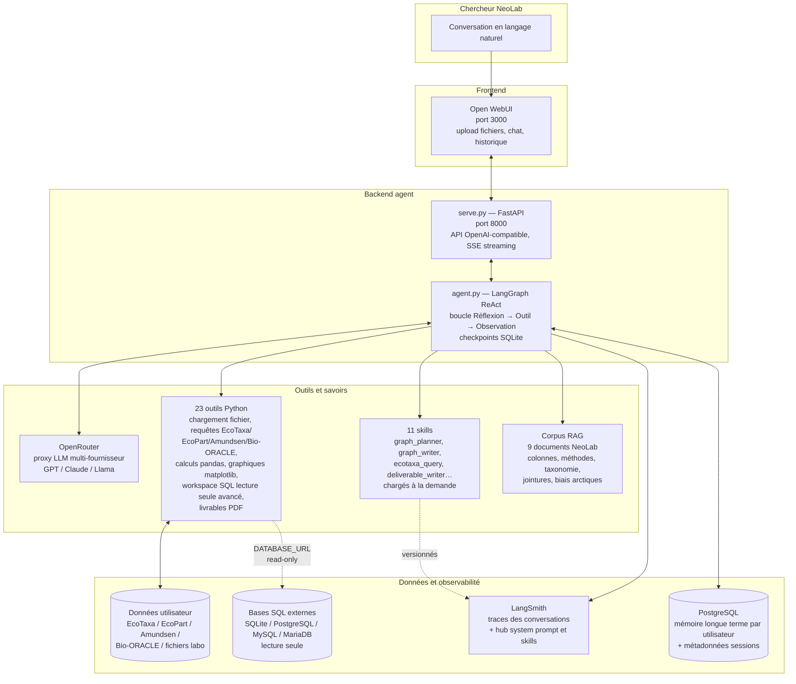
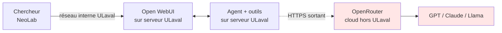
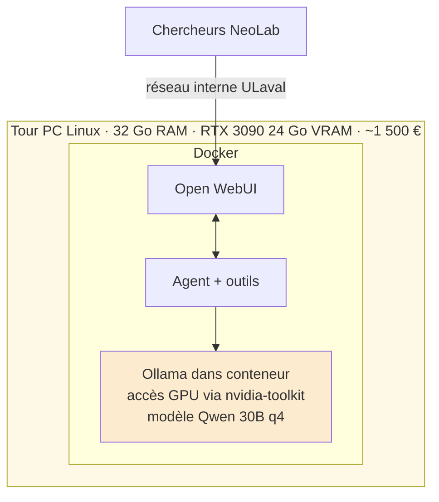

# Assistant graphique copépodes — Brief d'avancement

| | |
|---|---|
| **Auteur** | Tidiane Cissé |
| **Public** | Superviseurs NeoLab |
| **Date** | 2026-06-12 |
| **Statut** | V1 fonctionnelle en local |


## Résumé en une page

L'assistant graphique copépodes est opérationnel en local sur la machine de développement : un chercheur peut charger un fichier de données EcoTaxa, EcoPart, Amundsen CTD, Bio-ORACLE, un export labo, ou connecter une base SQL en lecture seule, puis demander en langage naturel un graphique, un calcul, une jointure ou un livrable PDF. Le système combine un grand modèle de langage (LLM), un corpus de neuf documents de référence (RAG) et 23 outils Python dédiés au domaine. Il refuse toute interprétation biologique : sa mission est de produire des graphiques reproductibles et traçables, pas de remplacer le chercheur.

L'agent est piloté par un *system prompt* unique qui fixe les règles de comportement (sources autorisées, ton clinique, refus d'interprétation, marquage des incertitudes). Onze *skills* spécialisés sont chargés à la demande pour les opérations spécifiques (extraction EcoTaxa, planification graphique, livrable PDF, etc.). Les use cases du PRD V1.3 (charger des données, interroger une source en ligne, générer des graphiques standards, préparer un livrable) sont couverts, sauf trois points reportés en V2 : la génération en R, les graphiques interactifs et l'intégration OGSL.

La prochaine étape est de sortir du local et de déployer l'agent et son interface (Open WebUI) sur des serveurs de l'Université Laval, avec un accès réservé aux membres de NeoLab. Le présent document décrit l'architecture actuelle, ce que l'agent sait faire, et les besoins concrets pour le déploiement.

---

## 1. Architecture en une vue



Les briques sont indépendantes : le frontend (Open WebUI) parle au backend (FastAPI / agent) via une API standard ; le backend orchestre LLM, outils et corpus RAG. Cette séparation rend chaque brique remplaçable.

### 1.1 La chaîne logicielle Open WebUI → LangChain → OpenRouter → LangSmith

L'agent n'est pas un seul morceau de code monolithique. Il combine quatre briques externes spécialisées, chacune avec un rôle précis. Comprendre ces quatre briques permet de savoir où le coût, la traçabilité et la flexibilité technologique se situent.

| Brique | Rôle | Pourquoi ce choix |
|---|---|---|
| **Open WebUI** | Interface chat du chercheur (frontend) : upload de fichiers, historique des conversations, affichage des graphiques et téléchargement des livrables. | Standard open-source mature ; parle nativement le protocole OpenAI, donc n'importe quel backend compatible peut être branché. |
| **LangChain / LangGraph** | Couche d'orchestration de l'agent (Python) : c'est elle qui exécute la boucle « réflexion → appel d'outil → observation → réponse », gère la mémoire de conversation, et coordonne les appels au LLM et aux 23 outils. | Bibliothèque la plus aboutie pour ce type d'agent à outils, large communauté, intégration native avec LangSmith. |
| **OpenRouter** | Proxy LLM multi-fournisseur : l'agent envoie ses requêtes à OpenRouter, qui les redirige vers GPT (OpenAI), Claude (Anthropic), Llama ou tout autre modèle pris en charge. | Évite l'enfermement fournisseur. Changer de modèle se fait en modifiant une seule variable (`LLM_MODEL`). Le code de l'agent reste identique. Une seule facture, un seul compte à gérer côté NeoLab. |
| **LangSmith** | Service d'observabilité et de stockage : (1) trace chaque conversation (séquence d'appels d'outils, réponses du LLM, latences, erreurs) pour audit ; (2) héberge le system prompt et les 11 skills versionnés, l'agent les recharge à chaque démarrage. | Permet d'auditer une conversation a posteriori, de comparer deux versions du prompt, et de modifier les règles métier sans redéployer le serveur. |

Une session de chercheur traverse donc cette chaîne : Open WebUI envoie le message à FastAPI (`serve.py`), qui passe la main à l'agent LangGraph, qui interroge le LLM via OpenRouter, qui répond, puis l'agent décide d'appeler un outil ou de rendre une réponse à Open WebUI ; en parallèle, toute la séquence est tracée vers LangSmith pour audit ultérieur.

Pour le déploiement ULaval (section 4), cela implique deux dépendances cloud externes incontournables : OpenRouter (pour le LLM) et LangSmith (pour les traces et le hub de prompts). Le serveur ULaval doit pouvoir les joindre par HTTPS sortant.

---

## 2. Ce que fait l'agent aujourd'hui

### 2.1 Sources de données

| Source | Contenu | Statut |
|---|---|---|
| **Fichier local** | CSV, TSV, Excel, JSON, Parquet — y compris exports UVP et fichiers labo | opérationnel |
| **EcoTaxa** | Taxonomie annotée, objets individuels, morphométrie | opérationnel |
| **EcoPart** | Profils UVP, volumes échantillonnés, CTD associée | opérationnel |
| **Amundsen CTD** | CTD officielle Amundsen via ERDDAP | opérationnel |
| **Bio-ORACLE** | Variables environnementales actuelles et futures | opérationnel |
| **Workspace SQL** | Connexion lecture seule à SQLite, PostgreSQL, MySQL ou MariaDB ; cartographie tables/vues/PK/FK ; preview filtré ; copie locale TSV des résultats | opérationnel |
| **OGSL** | Profils régionaux golfe du Saint-Laurent | annoncé, livraison V2 |

OBIS est hors périmètre.

### 2.2 Outils (23)

Les outils sont les actions concrètes que l'agent peut exécuter. Le LLM décide lequel appeler en fonction de la question. Ils sont regroupés en six catégories.

| Catégorie | Exemples d'outils | Rôle |
|---|---|---|
| Données fichiers | `load_file`, `run_pandas`, `run_graph` | Chargement, calculs tabulaires, rendu de graphiques |
| Sources en ligne | `list_*`, `preview_*`, `query_*` pour EcoTaxa, EcoPart, Amundsen, Bio-ORACLE | Découverte, aperçu, extraction |
| Jointures | `join_ecotaxa_ecopart`, `couple_zooplankton_bio_oracle` | Croiser biologique et environnemental |
| Workspace SQL | `list_sql_tables`, `preview_sql_table`, `copy_sql_query_to_workspace` | Cartographie d'une base SQL externe, inspection filtrée, jointures guidées par FK, copie TSV locale exploitable par pandas |
| Base de connaissances | `query_copepod_knowledge_base` | Recherche dans les 9 documents RAG |
| Skills et livrables | `load_skill`, `export_deliverable` | Chargement d'instructions spécialisées, PDF |

### 2.3 Skills (11)

Un skill est un document chargé en mémoire de l'agent au moment où une capacité spécialisée est nécessaire — comme un manuel ouvert juste avant de réaliser une opération. Les skills permettent de découpler le système prompt principal (court, stable) des instructions spécifiques à chaque source ou type de production.

| Skill | Sert à |
|---|---|
| `graph_planner` | Décider type de graphique, colonnes, niveau de confiance |
| `graph_writer` | Écrire le code matplotlib, appliquer la palette d'incertitude |
| `ecotaxa_query`, `ecopart_query`, `amundsen_ctd_query`, `bio_oracle_query` | Règles d'extraction pour chaque source en ligne |
| `environmental_join` | Stratégie de jointure biologique ↔ environnemental |
| `sql_workspace_query` | Règles d'usage du workspace SQL : lecture seule, jointures guidées par FK, limites de copie |
| `uvp_ecotaxa`, `uvp_ecopart` | Chargés automatiquement quand un export UVP est détecté |
| `deliverable_writer` | Structure et règles de citation d'un livrable PDF |

### 2.4 Corpus RAG (9 documents)

Le corpus est interrogeable par recherche sémantique avant chaque affirmation factuelle. Il couvre les colonnes des trois sources principales, les colonnes des fichiers labo, le périmètre taxonomique, les méthodes de calcul, les jointures environnementales, les zones géographiques de référence et la taxonomie WoRMS. Les documents sont en `core/copepod_rag/docs/`, indexés dans une base vectorielle ChromaDB locale.

### 2.5 Mémoire entre conversations

L'agent dispose d'une mémoire à deux niveaux qui survit aux redémarrages et aux changements de conversation.

**Mémoire courte terme** (par conversation) : l'historique complet du chat courant est conservé dans une base SQLite. Si le serveur redémarre en cours de conversation, l'agent reprend exactement là où il s'était arrêté, sans que le chercheur ait à tout répéter.

**Mémoire longue terme** (entre conversations) : après chaque échange, un modèle de langage analyse la conversation et extrait les faits durables — corrections, préférences, conventions de nommage, règles métier données par le chercheur. Ces faits sont stockés dans PostgreSQL et rattachés à l'identifiant de l'utilisateur Open WebUI.

Exemple concret : si un chercheur indique en session 1 « nos stations s'appellent toujours HC-XX », cette convention est mémorisée. En session 2, une nouvelle conversation, l'agent la connaît déjà sans qu'on ait besoin de la répéter.

```
Session 1
  Chercheur : "ne mets jamais les unités en µg/L, on travaille en mg/m³"
  → LangMem extrait et écrit en mémoire longue terme

Session 2 (nouvelle conversation, lendemain)
  → l'agent relit la mémoire au démarrage
  → respecte automatiquement la convention mg/m³
```

Ce qui est mémorisé : corrections sur les unités, préférences de style graphique, conventions de nommage propres au laboratoire, règles métier répétées. Ce qui n'est pas mémorisé : le contenu brut des données, les résultats numériques, les transcripts complets. La mémoire reste compacte et factuelle.

Chaque chercheur a sa propre mémoire isolée — les préférences de l'un ne contaminent pas les sessions d'un autre.

### 2.6 Garde-fous principaux

Quatre règles cardinales pilotent toutes les réponses de l'agent.

- **Aucune interprétation biologique.** L'agent produit des graphiques et des métadonnées techniques. L'interprétation scientifique appartient au chercheur.
- **Aucune valeur inventée.** Chaque chiffre vient d'une source identifiée, d'un calcul exécuté ou du corpus RAG. Sinon : « valeur inconnue ».
- **Aucune citation fabriquée.** Si la référence vérifiée manque, l'agent redirige vers Google Scholar ou Web of Science.
- **Incertitude visible.** Chaque graphique distingue visuellement les données confirmées, exploratoires et incertaines, avec un indicateur de confiance global.

Ces règles sont gravées dans le system prompt et reprises par les skills concernés. La version longue (29 contraintes) figure dans le PRD V1.3.

---

## 3. Statut d'implémentation

Le PRD V1.3 liste 14 use cases (UC-02 à UC-14 après renumérotation). Le runtime IDEA en couvre 11 entièrement et 3 partiellement. Le détail file par file est dans `IDEA/docs/UC_TRACEABILITY.md`.

| Bloc | Statut |
|---|---|
| Chargement, validation, nettoyage | opérationnel |
| Requêtes EcoTaxa / EcoPart / Amundsen / Bio-ORACLE | opérationnel |
| Production de graphiques (distribution verticale, spatio-temporel, taxonomie, CTD, lacunes, variable dérivée) | opérationnel |
| Workspace SQL lecture seule | opérationnel : SQLite/PostgreSQL/MySQL/MariaDB, découverte tables/vues/PK/FK, preview filtré, jointures guidées, copies TSV plafonnées |
| Livrable PDF (avec citations vérifiées) | opérationnel |
| Génération en R | reporté V2 |
| Graphiques interactifs | reporté V2 |
| Intégration OGSL | reporté V2 |
| Mémoire courte terme (reprise après restart) | opérationnel : SQLite checkpoints par conversation |
| Mémoire longue terme (entre conversations) | opérationnel : LangMem + PostgreSQL, isolée par utilisateur |
| Tests automatisés | 42 tests verts au dernier *merge* sur la branche principale |

Toute la documentation a été refondue en juin 2026 (CONTEXT, PRD V1.3, brief runtime, inventaire des outils, traçabilité UC). Le system prompt et les skills sont versionnés sur LangSmith Hub et rechargés automatiquement par l'agent.

---

## 4. Prochaine étape : déploiement à l'Université Laval

### 4.1 Pourquoi déployer

Aujourd'hui l'agent tourne sur la machine de développement via un script `serve.py` lancé à la main. Cela suffit pour valider la V1 mais bloque la suite :

- les chercheurs de NeoLab ne peuvent pas l'utiliser ;
- les conversations et les artefacts ne survivent pas à un arrêt local ;
- les coûts API LLM ne sont pas mutualisés ni suivis ;
- il n'y a pas d'accès depuis l'extérieur du poste.

L'objectif du déploiement est de basculer ces deux briques — l'agent FastAPI et l'interface Open WebUI — sur un serveur de l'Université Laval, derrière une authentification réservée à NeoLab.

### 4.2 Ce dont nous avons besoin (à transmettre au service IT)

| Besoin | Détail |
|---|---|
| **Serveur Linux** | Une VM ou un serveur dédié sous Linux récent (Ubuntu 22.04+ ou équivalent). 4 vCPU, 16 Go de RAM, 100 Go de stockage SSD couvrent largement la V1. Pas de GPU requis : le LLM tourne chez le fournisseur via API. |
| **Docker** | L'agent et Open WebUI sont déjà packagés en images Docker (`docker compose up`). Il suffit que la machine cible accepte de faire tourner Docker / Docker Compose. |
| **Accès Internet sortant** | L'agent doit pouvoir joindre, en HTTPS sortant, **OpenRouter** (proxy LLM, https://openrouter.ai/api/v1), **LangSmith** (traces et hub des prompts/skills, https://smith.langchain.com), et les sources de données : EcoTaxa, ERDDAP Amundsen, Bio-ORACLE. Pas d'Internet entrant requis si l'accès utilisateur reste interne ULaval. |
| **DNS et certificat TLS** | Une URL stable type `copepodes.ulaval.ca` avec un certificat valide pour servir Open WebUI en HTTPS. |
| **Authentification NeoLab** | Open WebUI doit être derrière une authentification réservée aux membres de NeoLab. Deux pistes : SSO via l'IDP officiel d'ULaval (CAS / SAML), ou restriction VPN/intranet. Le choix dépend de ce que l'IT facilite. |
| **Stockage persistant** | Un volume pour les conversations (checkpoints SQLite), un pour la base vectorielle, un pour les artefacts (graphiques PNG, livrables PDF). Sauvegarde quotidienne souhaitée. |
| **Gestion des secrets** | Les clés API (OpenRouter pour le LLM, EcoTaxa, EcoPart, LangSmith) doivent être stockées de manière sécurisée — fichier `.env` chiffré ou *secret manager* selon les pratiques ULaval. |
| **Suivi des coûts LLM** | Un compte OpenRouter dédié à NeoLab avec plafond mensuel paramétrable. OpenRouter centralise la facturation quel que soit le modèle utilisé (GPT, Claude, Llama, …), ce qui simplifie le suivi par rapport à des comptes séparés chez chaque fournisseur. |

---

## 5. Après le déploiement

### 5.1 Tests utilisateurs avec NeoLab

Une fois l'agent accessible aux membres de NeoLab, la priorité sera de collecter les usages réels :

- proposer à un petit groupe de chercheurs de l'utiliser sur leurs analyses courantes ;
- recueillir leurs retours, leurs blocages, leurs demandes ;
- ajuster les skills, les sources et le périmètre V1 en conséquence ;
- décider ensuite des chantiers V2 (intégration OGSL, génération R, graphiques interactifs, etc.) en fonction de la demande observée plutôt que de spéculations.

Cette phase de tests servira aussi à valider que les garde-fous (refus d'interprétation, marquage des incertitudes, traçabilité des sources) tiennent dans les conditions réelles, avant d'envisager une ouverture plus large.

### 5.2 Question de fond à instruire après les tests : où tourne le LLM ?

Aujourd'hui le LLM est appelé via OpenRouter, qui sert de proxy vers OpenAI, Anthropic ou d'autres fournisseurs. Cette dépendance soulève trois questions à instruire après la phase de tests utilisateurs, pour décider sur la base de l'usage réel et non de spéculations :

- **Souveraineté des données.** Le contenu des conversations transite par OpenRouter. Pour des données labo non publiées, ce transit hors ULaval peut être un blocage.
- **Coûts opérationnels.** Le coût croît linéairement avec l'usage. Plus les chercheurs s'en servent, plus la facture mensuelle grimpe.
- **Indépendance technologique.** Tarification, quotas et modèles disponibles évoluent côté fournisseur sans préavis.

Deux trajectoires sont possibles. Le choix dépendra du volume d'usage observé pendant les tests, du type de données effectivement traitées, et de ce que l'IT et les budgets permettent.

#### Trajectoire A — Assumer OpenRouter



On garde le modèle cloud, on encadre les usages : règle explicite sur ce qui peut ou ne peut pas être uploadé, plafond mensuel sur le compte OpenRouter, suivi par chercheur. C'est la trajectoire la plus simple et la moins coûteuse en infrastructure. Elle convient si les données labo sensibles restent marginales dans les usages observés.

#### Trajectoire B — Héberger un modèle « maison »

Faire tourner un modèle open-weight (famille Qwen, Llama, Mistral) sur une machine accessible à NeoLab. Le code de l'agent ne change quasiment pas — seule l'adresse du LLM est remplacée — donc la bascule reste réversible. À l'échelle d'un laboratoire, deux installations sont réalistes et défendables côté budget : enveloppe de 1 500 à 2 500 €, posées dans un bureau, branchées au réseau ULaval, sans rack datacenter ni GPU professionnel.

##### Option B1 — Mac mini Apple Silicon (~2 000 €)

```mermaid
flowchart TB
    subgraph MM[Mac mini M4 Pro · 48 Go RAM unifiée · ~2 000 €]
        direction TB
        OLM[Ollama natif macOS<br/>accélération Metal<br/>modèle Qwen 30B q4]
        subgraph DK[Docker Desktop]
            OW2[Open WebUI]
            AG2[Agent + outils]
        end
        OW2 <--> AG2
        AG2 -.host.docker.internal:11434.-> OLM
    end
    C2[Chercheurs NeoLab] -->|réseau interne ULaval| OW2
    style MM fill:#e8f4fd
    style OLM fill:#d6eaf8
```

Une boîte format Apple TV qu'on pose sur un bureau ou dans un placard ventilé. Ollama tourne nativement sur macOS et exploite l'accélération Metal de la puce Apple ; l'agent et Open WebUI tournent dans Docker Desktop et parlent à Ollama via `host.docker.internal`. Quasi-silencieux, faible consommation (~80 W en charge), maintenance niveau « comme un Mac classique ».

##### Option B2 — PC Linux + GPU NVIDIA (~1 500 €)



Une tour PC classique sous Linux Ubuntu, avec une carte graphique grand-public (RTX 3090 d'occasion ou RTX 4090 neuve). Tout tourne en Docker comme aujourd'hui. Plus rapide qu'un Mac mini en performance brute mais plus bruyant et plus énergivore (~350 W en charge). Maintenance niveau « PC Linux dans un labo ».

##### Comparaison rapide des deux options locales

| Critère | Mac mini M4 Pro 48 Go | PC + RTX 3090 24 Go |
|---|---|---|
| Prix indicatif | ~2 000 € | ~1 500 € (3090 d'occasion) |
| RAM utilisable par le modèle | 48 Go unifiée | 24 Go VRAM |
| Vitesse approximative (Qwen 30B q4) | ~25 tokens/s | ~40 tokens/s |
| Bruit | quasi-silencieux | ventilateurs audibles |
| Consommation pic | 80 W | 350 W |
| Encombrement | 13 × 13 × 5 cm | tour PC classique |
| OS / culture | macOS | Linux |
| Évolutivité | RAM soudée, achat pour la vie | GPU remplaçable plus tard |

Les deux conviennent à 1-5 chercheurs concurrents. Au-delà, il faudrait monter en gamme (Mac Studio, ou GPU type RTX 6000 Ada / L40S).

#### Choix à faire après les tests utilisateurs

L'enjeu n'est pas de trancher dès aujourd'hui. C'est d'avoir conscience que :

- la trajectoire A est gratuite à mettre en place mais coûte tous les mois ;
- la trajectoire B est un investissement unique de quelques milliers d'euros, ensuite gratuite à l'usage ;
- les deux trajectoires sont réversibles : passer de l'une à l'autre demande seulement de changer une variable d'environnement.

Le choix se fera à la lumière du volume d'usage réel, de la sensibilité des données effectivement traitées, et des préférences de l'IT et du laboratoire en termes de matériel à gérer. C'est pour cette raison que la question est listée dans les arbitrages avec l'IT en §4.3.

---

## Annexes (références internes)

- Architecture détaillée : `IDEA/docs/ARCHITECTURE.md`
- Inventaire des outils : `IDEA/docs/TOOLS.md`
- Traçabilité use cases / contraintes : `IDEA/docs/UC_TRACEABILITY.md`
- Spec produit complète (PRD V1.3) : `assistant-copepodes-specs/docs/PRD_IDEA_copepod.md`
- Glossaire métier et règles : `assistant-copepodes-specs/docs/CONTEXT.md`
- System prompt actif : `IDEA/agents/copepod_system_prompt.py` + hub LangSmith `copepod-system-prompt`
- Skills : `IDEA/agents/skills/` + hub LangSmith `copepod-*`
