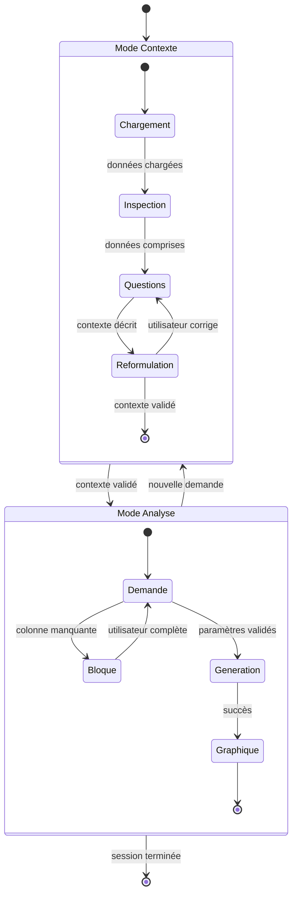
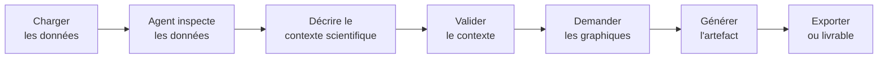
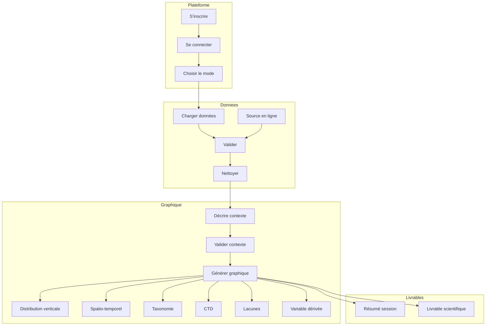

# Assistant graphique copépodes — PRD

| | |
|---|---|
| **Auteur** | Tidiane Cissé |
| **Version** | 1.1 — 2026-05-25 |
| **Statut** |Partiellement Approuvé |
| **Projet** | NeoLab, Université Laval |

---

## À propos de ce document

Ce document décrit les exigences produit de l'assistant graphique copépodes — une readaptation de la plateforme IDEA (Université d'Hawaii) adaptée aux besoins du laboratoire NeoLab (Université Laval).

Il s'adresse à toute personne qui veut comprendre ce que l'assistant fait, pour qui, et selon quelles règles.

---

## Table des matières

1. [Problème](#1-problème)
2. [Solution](#2-solution)
3. [Acteur](#3-acteur)
4. [Vue d'ensemble](#4-vue-densemble)
   - 4.1 [Modes de travail](#41-modes-de-travail)
   - 4.2 [Cycle de vie d'une session](#42-cycle-de-vie-dune-session)
   - 4.3 [Use Cases](#43-use-cases)
5. [Use Cases détaillés](#5-use-cases)
6. [Sources de données](#6-sources-de-données)
7. [Contraintes](#7-contraintes)
8. [Glossaire](#8-glossaire)

---

## Historique des versions

| Version | Date | Description |
|---|---|---|
| 1.0 | 2026-05-25 | Version initiale |

---

## 1. Problème

L'analyse exploratoire faites par le laboratoire NeoLab peut prendre du temps en raison des nombreuses données historiques possédées par le laboratoire.

Le processus de création de graphiques implique plusieurs étapes, chacune pouvant être source de friction.

---

## 2. Solution

Adapter la plateforme **IDEA** (Université d'Hawaii) aux besoins de NeoLab. Plusieurs choses changent :

1. **Le system prompt** — domaine copépodes, règles de production graphique, sources NeoLab
2. **Le contexte d'utilisation** — Usage dans un contexte de recherche scientifique donc plus de précision dans les réponses
3. **Les outils** — manipulation des données et génération de graphiques pour EcoTaxa, EcoPart, Amundsen CTD, OGSL, Bio-ORACLE et fichiers labo
4. **La documentation** — La documentation que l'agent va devoir utiliser

5. **L'interface utilisateur** — L'interface doit être adaptée pour faciliter l'interaction avec les données et les graphiques

---

## 3. Acteur

**Chercheur NeoLab** — professeur ou étudiant de NeoLab (Université Laval) qui travaille avec des données de copépodes. 

Aucune fonctionnalité n'est réservée à l'un ou l'autre même s'ils auraient des utilisations différentes.

---

## 4. Vue d'ensemble

### 4.1 Modes de travail

### 4.2 Cycle de vie d'une session

### 4.3 Use Cases

---

## 5. Use Cases détaillés

**UC-00 — S'inscrire** : créer un compte sur la plateforme. Hors périmètre de l'agent.

**UC-01 — Se connecter** : accéder à son espace de travail. Hors périmètre de l'agent.

**UC-02 — Choisir le mode de travail** : sélectionner Mode Contexte (discussion guidée, pas d'exécution) ou Mode Analyse (formulaire structuré → rapport statique).

**UC-03 — Charger des données** : déposer un fichier local (CSV, TSV, Excel, JSON, exports EcoTaxa/EcoPart). L'assistant inspecte les colonnes, types et valeurs manquantes automatiquement.

**UC-04 — Interroger une source en ligne** : activer une source (EcoTaxa, EcoPart, Amundsen CTD, OGSL, Bio-ORACLE) et lancer une requête paramétrée. Chaque source est activée individuellement.

**UC-05 — Valider les données chargées** : l'assistant retourne un rapport de colonnes disponibles, anomalies et analyses bloquées. Il ne modifie rien.

**UC-06 — Nettoyer les données** : l'assistant propose une méthode de nettoyage, l'utilisateur valide, le nettoyage s'applique sur une copie — jamais sur les données originales.

**UC-07 — Décrire le contexte graphique** : en Mode Contexte, l'assistant guide par questions ciblées (espèce, zone, variable, période, source). Aucune analyse n'est lancée.

**UC-08 — Valider la reformulation du contexte** : l'assistant soumet une reformulation structurée. Une fois validée, le contexte est verrouillé pour la génération.

**UC-09 — Générer un graphique** : l'assistant produit le graphique avec titre, axes, unités et source. Aucun graphique approximatif si une colonne requise est absente.

**UC-10 — Analyser la distribution verticale** : graphiques de distribution en profondeur depuis EcoTaxa et EcoPart. Nécessite la jointure `obj_orig_id` → `profile_id` pour accéder au volume échantillonné (EcoPart). Calcule concentration (ind/m³) ou biovolume par taxon ou stade. Bloqué si le volume échantillonné est absent.

**UC-11 — Analyser la distribution spatio-temporelle** : répartition des observations entre stations et campagnes. Identifie et représente les lacunes géographiques ou temporelles.

**UC-12 — Analyser la taxonomie et les stades** : composition taxonomique et répartition par stades de vie, sur annotations validées (statut V EcoTaxa). Si le statut de validation est absent, l'assistant demande inclusion/exclusion avant de générer.

**UC-13 — Analyser les variables environnementales CTD** : graphiques des variables CTD (température, salinité, oxygène, fluorescence) associées aux données biologiques. La jointure entre sources est documentée avec clé, tolérance temporelle et spatiale, et pertes éventuelles. Priorité Amundsen CTD sur OGSL pour le même besoin.

**UC-14 — Évaluer la complétude et les lacunes** : rapport de remplissage par colonne clé — disponible, partiel, absent. Identifie les variables qui bloquent des analyses spécifiques. Exportable pour demande de subvention.

**UC-15 — Calculer une variable dérivée** : concentration (ind/m³), biomasse carbone (mg C/m²), longueur prosome, indice de plénitude lipidique. La méthode (formule, colonnes, unités, limites) est soumise pour validation avant exécution. Aucun calcul si une colonne obligatoire manque.

**UC-16 — Exporter le résumé de session** : résumé structuré — contexte, sources, méthodes, résultats, limites.

**UC-17 — Préparer un livrable scientifique** : document structuré avec figures, titres, légendes, méthodes, citations vérifiées et limites. Support de révision pour le chercheur — pas une publication finale.

---

## 6. Sources de données

| Source | Contenu | Accès |
|---|---|---|
| **EcoTaxa** | Taxonomie annotée, objets individuels, morphométrie | Compte requis |
| **EcoPart** | Profils UVP, volumes échantillonnés, CTD associée | Compte requis |
| **Amundsen CTD** | CTD officielle campagne Amundsen via ERDDAP | Public |
| **OGSL** | Profils régionaux golfe du Saint-Laurent | Public |
| **Bio-ORACLE** | Variables environnementales actuelles et futures | Public |
| **Fichier labo** | CSV/Excel fournis par l'utilisateur | Upload direct |

---

## 7. Contraintes

| ID | Règle |
|---|---|
| CT-AG-01 | Toute analyse, graphique ou calcul cite la source de données utilisée. |
| CT-AG-02 | Aucune valeur absente n'est complétée par supposition. |
| CT-AG-03 | Chaque résultat est qualifié : fiable / exploratoire / impossible. |
| CT-AG-04 | Aucune analyse sans contexte validé (espèce, zone, variable, période, source). |
| CT-AG-05 | Les colonnes requises sont vérifiées avant tout calcul. Calcul bloqué si absent. |
| CT-AG-06 | La méthode (colonnes, formule, limites) est soumise pour validation avant exécution. |
| CT-AG-07 | Toute jointure est documentée : clé, tolérance, pertes, qualité du rapprochement. |
| CT-AG-08 | L'assistant communique ce que chaque source permet ou ne permet pas. |
| CT-AG-09 | Le code généré est traçable, visible sur demande, et ses erreurs sont expliquées. |
| CT-AG-10 | Les données brutes ne sont jamais modifiées. Toute transformation crée une copie. |
| CT-AG-11 | Aucun credential n'est affiché, logué ou inclus dans un livrable. |
| CT-AG-12 | Les téléchargements sont proportionnés à la question — pas d'ingestion massive. |
| CT-AG-13 | L'agent ne produit aucune interprétation scientifique ou biologique. |
| CT-AG-14 | Tout graphique inclut titre, axes, unités, source, filtres et limites. |
| CT-AG-15 | Les livrables ne contiennent aucune citation inventée. |
| CT-AG-16 | Périmètre V1 : exploration, validation, graphiques standards, livrables simples. |
| CT-AG-17 | Les paramètres du modèle sont configurés pour la reproductibilité (temperature = 0.0). |
| CT-AG-18 | Réponses courtes et orientées résultat — pas de narration générative. |
| CT-AG-19 | Toute affirmation factuelle est reliée à une source, colonne ou calcul. |
| CT-AG-20 | Chaque résultat inclut l'identifiant de source, les colonnes utilisées et le script. |
| CT-AG-21 | L'assistant vérifie la cohérence entre les sorties et les données sources. |
| CT-AG-22 | Les analyses longues retournent un rapport statique complet — pas de streaming. |
| CT-AG-23 | Mode Contexte : discussion guidée, pas d'exécution. Mode Analyse : formulaire structuré → rapport statique. |
| CT-AG-24 | Les résultats s'affichent en bloc complet — pas de streaming progressif. |
| CT-AG-25 | Une demande vague ne déclenche pas d'analyse. Un contexte minimal est exigé. |
| CT-AG-26 | Vocabulaire technique et neutre — pas de ton anthropomorphique. |
| CT-AG-27 | Les résultats incertains sont visuellement distincts des résultats confirmés. |
| CT-AG-28 | Les livrables soutiennent la rédaction du chercheur — ils ne la remplacent pas. |
| CT-AG-29 | Les absences dans les données distinguent : absence confirmée, biais d'échantillonnage, incertitude d'identification. |

---

## 8. Glossaire

| Terme | Définition |
|---|---|
| **IDEA** | Plateforme d'analyse développée à l'Université d'Hawaii (sea-level). Runtime réutilisé pour le profil copépodes NeoLab. |
| **CopepodProfile** | Profil IDEA adapté au domaine copépodes NeoLab : system prompt, outils et RAG remplacés. |
| **EcoTaxa** | Plateforme de classification d'images de zooplancton (UVP5, LOKI, ZooScan). |
| **EcoPart** | Plateforme complémentaire à EcoTaxa : profils UVP, volumes échantillonnés, CTD associée. |
| **CTD** | Conductivity-Temperature-Depth. Instrument de mesure des propriétés physiques de l'eau. |
| **Statut V** | Annotation validée par un humain dans EcoTaxa. Seul statut utilisé pour les graphiques taxonomiques par défaut. |
| **Corpus RAG** | 5 documents de référence : colonnes_sources, colonnes_instruments, copepodes_domaine, methodes_calcul, sources_en_ligne. |
| **Mode En Ligne** | État de session dans lequel une source externe est activée.  |
| **Artefact** | Fichier produit et sauvegardé par l'assistant (graphique PNG/SVG, table de travail, résumé). |
