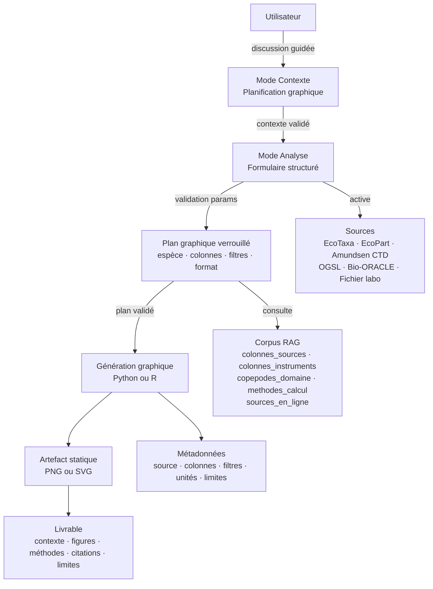
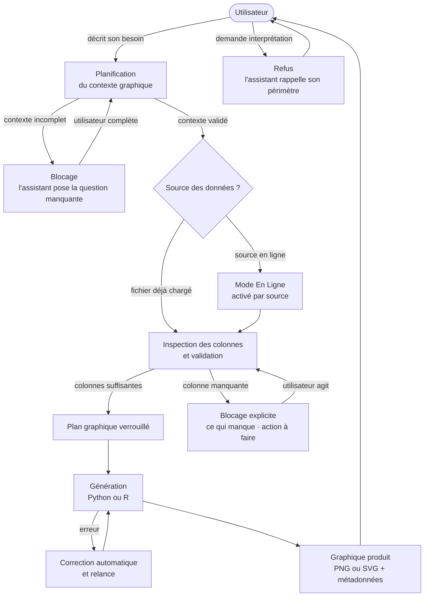
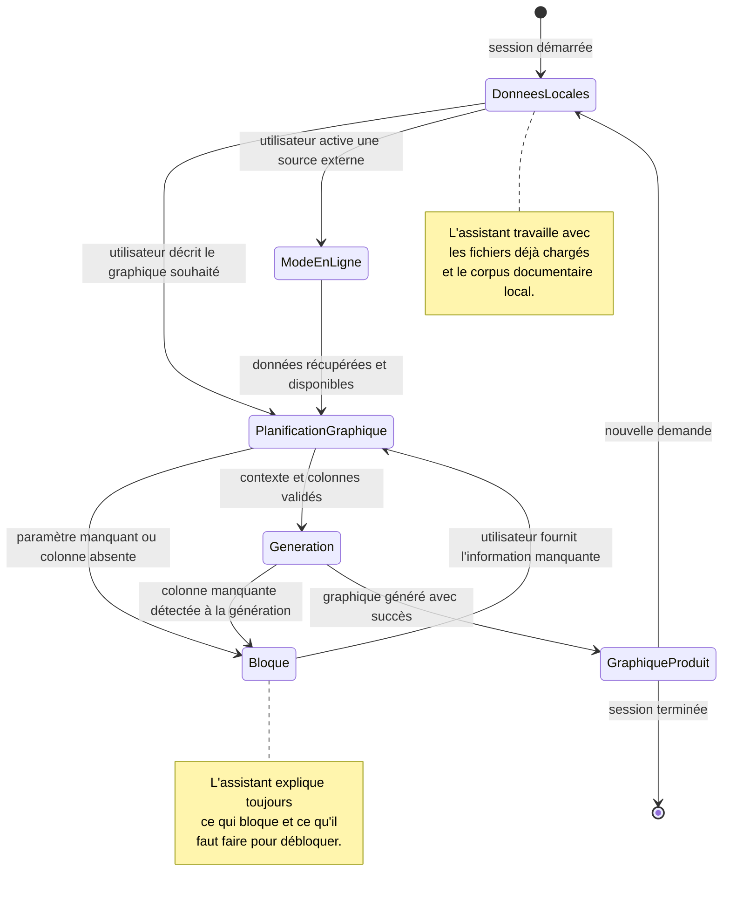
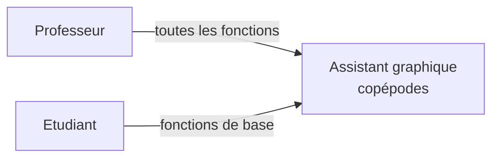
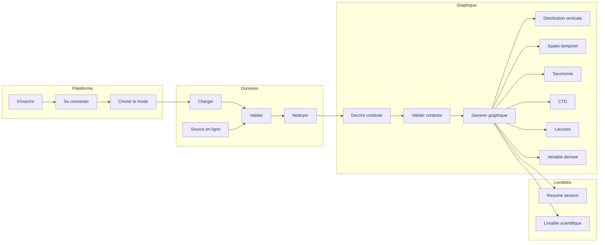
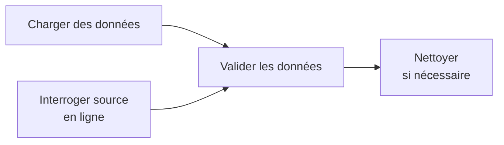
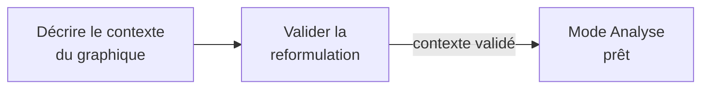
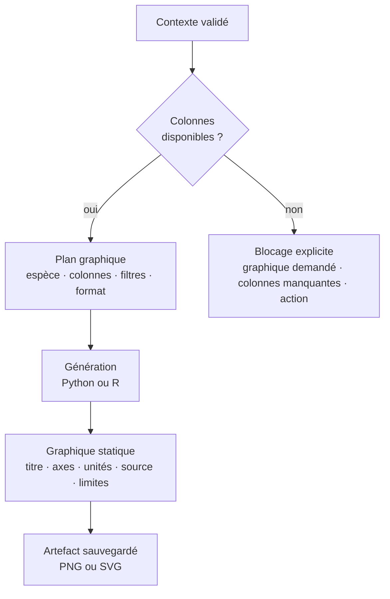
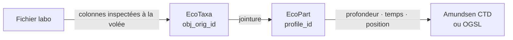
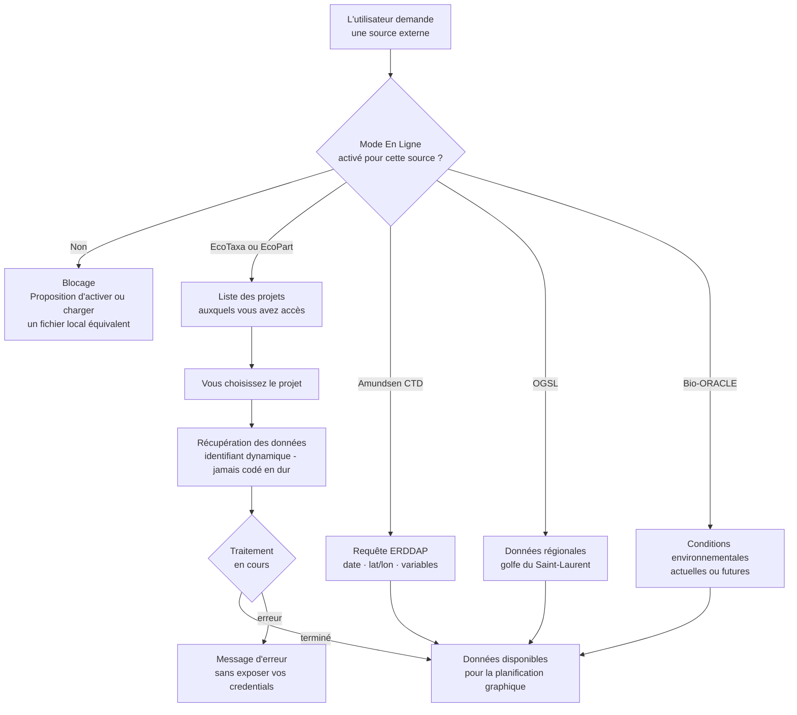

# Assistant graphique copépodes
## Document des exigences produit (PRD)

| Champ | Valeur |
|---|---|
| **Projet** | Assistant graphique copépodes — NeoLab, Université Laval |
| **Version** | 1.0 |
| **Date** | 2026-05-25 |
| **Auteur** | Flinguee75 |
| **Statut** | Approuvé — prêt pour implémentation |
| **Plateforme cible** | IDEA (fork FastAPI multi-agent) |

---

## Historique des versions

| Version | Date | Auteur | Description |
|---|---|---|---|
| 0.1 | 2026-03 | Flinguee75 | Use cases V1 initiaux (18 UC) |
| 0.2 | 2026-04 | Flinguee75 | Capacités agent V1 (14 capacités, 29 contraintes) |
| 0.3 | 2026-05 | Flinguee75 | Addendum V2 : identité graphique, suppression OBIS/CMEMS, ajout OGSL/Bio-ORACLE |
| 1.0 | 2026-05-25 | Flinguee75 | PRD consolidé — arbitrages CONTEXT.md vs data.js résolus |

---

## Résolution des contradictions de spec

> **Règle unique appliquée :** `docs/CONTEXT.md` et `Contraintes agent V1.md § Addendum V2` ont priorité sur `visualization/data.js` dans tous les conflits.

| Point de friction | Ancienne spec (data.js) | Décision finale |
|---|---|---|
| OBIS | Source activable, tools présents | **Supprimé** du périmètre |
| CMEMS | Listée dans UC-SL-04 | **Supprimée** (absente de CONTEXT.md) |
| OGSL | Absent | **Ajouté** — source régionale prioritaire golfe St-Laurent |
| Bio-ORACLE | Absent | **Ajouté** — couplage zooplancton / environnement futur |
| Identité agent | Assistant scientifique analytique | **Assistant graphique copépodes** — zéro interprétation |
| CT-AG-13 | "Ne pas surinterpréter" | **Renforcé** : interdiction totale d'interprétation scientifique |
| AG-V1-09 | Analyse exploratoire autonome | **Restreint** : au service du graphique uniquement |
| AG-V1-11 | Réponses biologiques autonomes | **Restreint** : uniquement pour planifier un graphique |
| UC-SL-07/08 | Mode Contexte scientifique | **Conservé** — repositionné comme planification graphique |
| AG-V1-10 | Comparaison avec OBIS | **Mis à jour** : comparaison contre corpus RAG local uniquement |

---

# 1. Contexte et problème

## 1.1 Contexte

NeoLab (Université Laval) produit et analyse des données de copépodes marins issues de plusieurs instruments et sources hétérogènes : UVP5 (EcoTaxa/EcoPart), LOKI (EcoTaxa), CTD Rosette Amundsen, et fichiers de laboratoire (lipides, biomasse carbone).

Ces sources ont des formats, des colonnes et des conventions d'unités différents. Les croiser pour produire un graphique scientifique correct requiert de maîtriser des jointures spécifiques (ex. `obj_orig_id` → `profile_id`), des règles de validation taxonomique (statut V EcoTaxa), et des méthodes de calcul documentées (concentration en ind/m³, longueur prosome).

## 1.2 Problème

Sans outillage dédié, produire un graphique reproductible à partir de ces sources peut prendre plusieurs heures — même pour un chercheur expérimenté. Il n'existe pas aujourd'hui d'assistant capable de :

- guider la planification graphique selon le contexte scientifique
- valider les colonnes disponibles et signaler les blocages avant génération
- produire des graphiques sourcés et traçables sans que l'utilisateur écrive du code
- gérer dynamiquement plusieurs sources sans identifiants codés en dur

## 1.3 Objectifs métier

| Code | Objectif | Critère de succès |
|---|---|---|
| **SLA** | Explorer et visualiser une question scientifique sur les copépodes sans écrire de code | L'utilisateur obtient un graphique exploitable, sources citées, limites explicites |
| **SLB** | Évaluer la couverture et les lacunes des données pour orienter la recherche ou une demande de subvention | L'utilisateur reçoit un rapport distinguant données disponibles, partielles et absentes |

---

# 2. Solution

## 2.1 Description

Intégrer dans IDEA un profil agent spécialisé — **CopepodProfile** — dont la mission unique est la **production de graphiques scientifiques reproductibles** à partir de données copépodes.

L'agent guide la planification graphique, valide les données, génère les graphiques en Python ou R, et prépare des livrables structurés pour révision humaine. Il refuse toute interprétation scientifique et toute approximation si les données requises sont absentes.

## 2.2 Architecture générale

## 2.3 Cycle de vie d'une session

Du premier message au graphique final.

## 2.4 États de la session

---

# 3. Utilisateurs

## 3.1 Acteurs

## 3.2 Droits par acteur

| Fonctionnalité | Professeur | Étudiant |
|---|:---:|:---:|
| Charger ses propres fichiers | ✅ | ✅ |
| Valider et explorer les données | ✅ | ✅ |
| Décrire le contexte graphique | ✅ | ✅ |
| Générer un graphique | ✅ | ✅ |
| Exporter un résumé de session | ✅ | ✅ |
| Activer une source en ligne | ✅ | — |
| Calculer des variables dérivées | ✅ | — |
| Nettoyer les données | ✅ | — |
| Préparer un livrable scientifique | ✅ | — |

---

# 4. Use Cases

## 4.1 Vue d'ensemble

## 4.2 Plateforme

**UC-00 — S'inscrire**
Créer un compte utilisateur. Aucun prérequis. Hors périmètre de l'agent — fonctionnalité plateforme uniquement.

**UC-01 — Se connecter**
Accéder à son espace de travail avec ses identifiants. Hors périmètre de l'agent.

**UC-02 — Choisir son mode de travail**
Au démarrage de chaque session, l'utilisateur choisit son mode :

| Mode Contexte | Mode Analyse |
|---|---|
| Discussion guidée | Formulaire structuré |
| Questions pour clarifier le graphique souhaité | Validation des paramètres, puis analyse |
| Aucune analyse exécutée | Rapport statique complet à la fin |

## 4.3 Gestion des données

**UC-03 — Charger des données**
L'utilisateur charge un ou plusieurs fichiers (CSV, TSV, Excel, JSON, exports EcoTaxa/EcoPart). L'assistant inspecte automatiquement les colonnes, types, unités et valeurs manquantes. Un rapport de validation est retourné avant toute analyse.

**UC-04 — Interroger une source en ligne** *(Professeur)*
L'utilisateur active une source — EcoTaxa, EcoPart, Amundsen CTD, OGSL ou Bio-ORACLE — et lance une requête paramétrée. L'assistant respecte les limites de chaque source et ne fait pas de téléchargements massifs non justifiés.

**UC-05 — Valider les données chargées**
L'assistant inspecte les données de la session : colonnes disponibles avec type et unité, valeurs manquantes, anomalies, colonnes bloquantes (ex. volume absent → concentration impossible). Il retourne un rapport structuré sans modifier les données.

**UC-06 — Nettoyer les données** *(Professeur)*
L'assistant propose une méthode de nettoyage (filtrage, renommage, conversion d'unités). L'utilisateur valide ou modifie. Le nettoyage s'applique sur une **copie** — jamais sur les fichiers originaux.

## 4.4 Planification graphique

**UC-07 — Décrire le contexte graphique** *(Mode Contexte)*
L'assistant guide l'utilisateur par des questions ciblées : espèce ou groupe cible, zone géographique et campagne, variable d'intérêt, période, données disponibles. Aucune analyse n'est lancée pendant cette étape.

**UC-08 — Valider la reformulation du contexte**
L'assistant présente une reformulation structurée du contexte graphique. L'utilisateur valide ou corrige. Une fois validé, le contexte est verrouillé — l'assistant ne redemande pas ces informations pendant la génération.

## 4.5 Production graphique

**UC-09 — Générer un graphique**
L'assistant génère une visualisation à partir des données chargées. Il présente d'abord le plan (colonnes, filtres, format) pour validation. Chaque graphique contient obligatoirement : titre descriptif, axes nommés avec unités, source des données, filtres appliqués, limites techniques.

**UC-10 — Analyser la distribution verticale** *(Professeur)*
Distribution en profondeur des copépodes depuis EcoTaxa et EcoPart. Jointure `obj_orig_id` → `profile_id`, calcul de concentration (ind/m³) ou biovolume, profils verticaux par taxon ou stade.

**UC-11 — Analyser la distribution spatio-temporelle** *(Professeur)*
Répartition spatiale et temporelle entre stations et campagnes. Identification des zones ou périodes sans données (lacunes).

**UC-12 — Analyser la taxonomie, les stades et les absences**
Composition taxonomique et répartition par stades de vie, sur données validées par un humain (statut V EcoTaxa). Si le statut de validation est absent ou ambigu, l'assistant demande inclusion/exclusion avant toute génération.

**UC-13 — Analyser les variables environnementales CTD** *(Professeur)*
Variables CTD (température, salinité, oxygène, fluorescence) associées aux données biologiques. Jointure documentée : clé, tolérance temporelle et spatiale, pertes.

**UC-14 — Évaluer la complétude et les lacunes** *(Professeur)*
Taux de remplissage des colonnes clés. Variables critiques inutilisables. Rapport distinguant :
- **Disponible** — utilisable pour l'analyse
- **Partiel** — données incomplètes ou incertaines
- **Absent** — bloque certaines analyses

Rapport exportable pour demande de subvention.

**UC-15 — Calculer une variable dérivée** *(Professeur)*
Concentration (ind/m³), biomasse carbone (mg C/m²), longueur prosome, indice de plénitude lipidique. Méthode présentée (formule, colonnes requises, unités, limites) avant exécution. Aucun calcul si colonne obligatoire absente.

## 4.6 Livrables

**UC-16 — Exporter le résumé de session**
Résumé structuré de la session : contexte graphique, sources mobilisées, méthodes, résultats, limites techniques.

**UC-17 — Préparer un livrable scientifique** *(Professeur)*
Livrable structuré : contexte, figures, titres, légendes, méthodes, citations vérifiées, limites. Document de révision pour le chercheur — pas une publication finale. Les résultats manquants ou incomplets sont signalés explicitement.

---

# 5. Sources de données

## 5.1 Sources disponibles

| Source | Contenu | Accès |
|---|---|---|
| **EcoTaxa** | Taxonomie annotée, objets individuels, morphométrie (UVP5, LOKI) | Compte EcoTaxa requis |
| **EcoPart** | Profils UVP, volumes échantillonnés, CTD associée | Compte EcoPart requis |
| **Amundsen CTD** | CTD officielle campagne Amundsen via ERDDAP | Public |
| **OGSL** | Profils régionaux golfe du Saint-Laurent | Public |
| **Bio-ORACLE** | Variables environnementales actuelles et futures | Public |
| **Fichier labo** | CSV/Excel fournis par l'utilisateur (lipides, biomasse…) | Upload direct |

> Chaque source doit être activée explicitement. L'assistant n'utilise jamais une source sans que l'utilisateur l'ait chargée ou activée.
> Amundsen CTD est prioritaire sur OGSL quand les deux couvrent le même besoin.

## 5.2 Schéma de jointure

Clé principale : `obj_orig_id` → `profile_id`. Toute jointure est documentée (clé, tolérance, pertes, qualité du rapprochement).

## 5.3 Accès aux sources en ligne

---

# 6. Exigences fonctionnelles

Les exigences suivantes découlent directement des use cases. Chaque exigence est traçable à une contrainte agent (CT-AG-XX).

## 6.1 Données et sources

| ID | Exigence | Contrainte |
|---|---|---|
| EF-01 | L'assistant cite la source de toute donnée affichée | CT-AG-01 |
| EF-02 | L'assistant ne complète jamais une valeur absente par supposition | CT-AG-02 |
| EF-03 | L'assistant qualifie chaque résultat : fiable / exploratoire / impossible | CT-AG-03 |
| EF-04 | Les données brutes ne sont jamais modifiées — toute transformation crée une copie | CT-AG-10 |
| EF-05 | Toute jointure est documentée (clé, tolérance, pertes, qualité) | CT-AG-07 |
| EF-06 | Les sources en ligne sont activées par source, jamais globalement | CT-AG-08 |
| EF-07 | Les project IDs EcoTaxa/EcoPart sont découverts dynamiquement, jamais codés en dur | CT-AG-08 |
| EF-08 | Les credentials ne sont jamais affichés, loggés ou inclus dans les livrables | CT-AG-11 |
| EF-09 | Les téléchargements sont proportionnés à la question — pas d'ingestion massive | CT-AG-12 |

## 6.2 Planification et génération graphique

| ID | Exigence | Contrainte |
|---|---|---|
| EF-10 | L'assistant exige un contexte validé avant toute génération | CT-AG-04, CT-AG-25 |
| EF-11 | L'assistant présente le plan graphique pour validation avant d'exécuter | CT-AG-06 |
| EF-12 | L'assistant vérifie les colonnes requises avant tout calcul | CT-AG-05 |
| EF-13 | Si une colonne obligatoire manque, l'assistant explique le blocage et ne génère rien | CT-AG-05 |
| EF-14 | Tout graphique contient : titre, axes, unités, source, filtres, limites | CT-AG-14 |
| EF-15 | Les graphiques sont statiques par défaut (PNG/SVG) | CT-AG-24 |
| EF-16 | Chaque artefact produit est sauvegardé dans la session | CT-AG-20 |
| EF-17 | Le statut de validation taxonomique EcoTaxa est signalé si absent ou ambigu | CT-AG-03, CT-AG-27 |

## 6.3 Qualité et traçabilité

| ID | Exigence | Contrainte |
|---|---|---|
| EF-18 | L'assistant refuse toute interprétation scientifique ou biologique | CT-AG-13 |
| EF-19 | L'incertitude est visuellement distincte des résultats confirmés | CT-AG-27 |
| EF-20 | Toute affirmation factuelle est reliée à une source, colonne ou calcul | CT-AG-19 |
| EF-21 | Les livrables ne contiennent aucune citation inventée | CT-AG-15 |
| EF-22 | Toutes les opérations sont tracées (Langfuse : LLM + RAG + tools) | CT-AG-20 |
| EF-23 | Les analyses longues retournent un rapport statique complet, pas de streaming | CT-AG-22, CT-AG-24 |

## 6.4 Interface

| ID | Exigence | Contrainte |
|---|---|---|
| EF-24 | Le Mode Contexte autorise la discussion guidée — aucune analyse exécutée | CT-AG-23 |
| EF-25 | Le Mode Analyse passe par un formulaire structuré → validation → rapport statique | CT-AG-23 |
| EF-26 | L'assistant répond dans la langue de l'utilisateur (français par défaut si ambigu) | CT-AG-26 |
| EF-27 | Le vocabulaire est technique et neutre — pas de ton anthropomorphique | CT-AG-26 |

---

# 7. Exigences non fonctionnelles

| ID | Exigence | Cible |
|---|---|---|
| ENF-01 | **Reproductibilité** — une même analyse rejouée doit produire le même résultat | temperature = 0.0, version modèle fixée |
| ENF-02 | **Traçabilité** — toutes les opérations visibles dans Langfuse | 100 % des appels LLM + RAG + tools tracés |
| ENF-03 | **Sécurité** — aucun credential exposé dans les sorties | Zéro token/password dans les réponses et livrables |
| ENF-04 | **Intégrité des données** — données brutes immuables | Toute transformation sur copie nommée |
| ENF-05 | **Langue** — réponses en français ou anglais selon l'utilisateur | Détection automatique, français par défaut |
| ENF-06 | **Limites V1** — pas de modèle prédictif, pas d'automatisation complète | Périmètre délimité par CT-AG-16 |

---

# 8. Ce qui est hors périmètre (V1)

- Modèles prédictifs ou inférence causale
- Interprétation scientifique ou biologique des résultats
- Publication scientifique finale (les livrables sont des supports de révision humaine)
- Automatisation complète sans validation humaine à chaque étape
- Ingestion massive de données non contrôlée
- OBIS comme source activable
- CMEMS
- Graphiques JavaScript/D3 par défaut

---

# 9. Contraintes transversales

> **Guide de lecture :** cette section est une référence complète, pas à lire linéairement. Consultez-la quand vous cherchez le comportement attendu dans une situation précise.

## 9.1 Données et sources

**CT-AG-01 — Toujours citer les sources**
Tout résultat affiché (graphique, tableau, calcul) indique la source : fichier, projet, URL ou document de référence. Un résultat sans source est signalé comme incomplet.

**CT-AG-02 — Ne pas inventer de données**
Si une valeur est absente, l'assistant ne la complète pas par supposition. Il signale ce qui manque et propose une source à activer ou une alternative.

**CT-AG-03 — Qualifier le niveau de fiabilité**
- *Fiable* : données complètes, colonnes et unités vérifiées
- *Exploratoire* : données partielles ou jointure incertaine
- *Impossible* : colonne ou méthode indispensable absente

**CT-AG-04 — Contexte obligatoire avant analyse**
Aucune analyse sans contexte validé : espèce ou groupe cible, zone, variable, période, source. Si un champ manque, l'assistant pose la question ciblée.

**CT-AG-05 — Valider les colonnes avant calcul**
Colonnes requises vérifiées (présence, type, unité) avant tout calcul. Si une colonne obligatoire manque, le calcul est bloqué avec explication.

**CT-AG-06 — Méthode soumise avant exécution**
Méthode présentée (données, colonnes, formule, limites) et validation explicite attendue avant tout calcul ou jointure.

**CT-AG-07 — Tracer les jointures**
Clé utilisée, tolérance (temps, position, profondeur), pertes, qualité du rapprochement. Une jointure incertaine est signalée comme limite.

**CT-AG-08 — Respecter les limites des sources**
L'assistant communique explicitement ce que chaque source permet ou ne permet pas. Exemples : EcoTaxa ne contient pas toujours le volume échantillonné ; EcoPart ne donne pas d'annotation individuelle.

**CT-AG-09 — Code traçable et explicable**
Code visible sur demande, traçable à la session, erreurs expliquées — aucune erreur masquée.

**CT-AG-10 — Données brutes préservées**
Fichiers originaux jamais modifiés. Toute transformation (nettoyage, filtrage, calcul) produit une copie nommée.

**CT-AG-11 — Credentials protégés**
Aucun token, mot de passe ou variable d'environnement affiché, logué ou inclus dans un livrable.

**CT-AG-12 — Requêtes proportionnées**
Téléchargement limité à ce qui est nécessaire. Inspection des métadonnées avant téléchargement ; validation demandée avant une récupération lourde.

## 9.2 Qualité scientifique

**CT-AG-13 — Zéro interprétation scientifique**
Aucune interprétation scientifique ou biologique. L'assistant présente des graphiques et des métadonnées techniques. L'interprétation appartient entièrement au chercheur. Si l'utilisateur en demande une, l'assistant refuse et rappelle son périmètre.

**CT-AG-14 — Graphiques lisibles et sourcés**
Tout graphique inclut : titre ou intention, axes nommés, unités, source, filtres ou périmètre, limites importantes.

**CT-AG-15 — Citations vérifiées dans les livrables**
Seules les sources et méthodes réellement utilisées apparaissent dans les livrables. Aucune référence bibliographique inventée. Les emplacements sans citation disponible sont laissés vides, explicitement signalés.

**CT-AG-16 — Périmètre V1**
L'assistant V1 est centré sur l'exploration, la validation, les graphiques standards et les livrables simples. Toute demande dépassant ce périmètre est signalée et marquée V2.

**CT-AG-17 — Reproductibilité des réponses**
Paramètres du modèle configurés pour la stabilité (température minimale, version fixée). Une même analyse peut être rejouée depuis le journal d'exécution complet.

**CT-AG-18 — Réponses courtes et orientées résultat**
Format attendu : résultat → source → méthode → limite → action suivante. Pas de longs paragraphes narratifs.

**CT-AG-19 — Ancrage dans les données**
Toute affirmation factuelle reliée à une source, un document RAG, une colonne ou un calcul. Si aucune preuve n'est disponible, l'assistant le dit explicitement.

**CT-AG-20 — Traçabilité des résultats**
Chaque résultat inclut : identifiant de la source, colonne(s) utilisée(s), script appliqué, horodatage si applicable.

**CT-AG-21 — Cohérence entre sortie et données sources**
Avant d'afficher un résultat, l'assistant vérifie que les chiffres et affirmations sont cohérents avec les données sources.

## 9.3 Interface et comportement

**CT-AG-22 — Analyses longues traitées en tâche de fond**
Analyses non triviales traitées comme des jobs — rapport statique complet retourné à la fin, pas de réponse progressive.

**CT-AG-23 — Séparation Mode Contexte / Mode Analyse**
Mode Contexte : discussion guidée autorisée, aucune analyse exécutée.
Mode Analyse : formulaire structuré → validation → rapport statique. Pas de champ texte libre infini.

**CT-AG-24 — Rapport en bloc statique**
Résultats affichés en bloc complet — pas de streaming progressif mot à mot.

**CT-AG-25 — Contexte minimal exigé**
Une demande vague ("analyse ce fichier") ne déclenche pas d'analyse. L'assistant exige au minimum : objectif, espèce ou variable cible, source de données.

**CT-AG-26 — Vocabulaire technique et neutre**
Pas de "je", pas de formules décoratives, pas de ton anthropomorphique. Format sobre, orienté résultat.

**CT-AG-27 — Incertitude visible**
Résultats incertains ou exploratoires visuellement distincts des résultats fiables. Un résultat incertain n'est jamais présenté comme une conclusion confirmée.

**CT-AG-28 — Livrables pour révision humaine**
Livrables = documents préparatoires structurés. Ils soutiennent la rédaction du chercheur, ils ne la remplacent pas.

**CT-AG-29 — Contextualiser les absences dans les données**
Lors d'une comparaison de couverture, distinction explicite entre :
- *Absence confirmée* : l'espèce ou la zone n'est documentée dans aucune source pour ce périmètre
- *Absence probable par biais d'échantillonnage* : documentée ailleurs, absente ici — saison, profondeur, instrument ou campagne
- *Absence incertaine* : identification morphologique insuffisante (*C. glacialis* vs *C. finmarchicus* dans les zones de chevauchement)

Pour les données arctiques : sous-représentation des données hivernales, couverture géographique inégale, incertitude d'identification historique signalées.

---

# 10. Glossaire

| Terme | Définition |
|---|---|
| **EcoTaxa** | Plateforme de classification d'images de zooplancton. Fournit taxonomie annotée, objets individuels et morphométrie par instrument (UVP5, LOKI, ZooScan). |
| **EcoPart** | Plateforme complémentaire à EcoTaxa. Fournit les profils UVP (volumes échantillonnés, CTD associée, particules agrégées). |
| **CTD** | Conductivity-Temperature-Depth. Instrument de mesure des propriétés physiques de l'eau en fonction de la profondeur. |
| **ERDDAP** | Serveur de données environnementales. Fournit les données CTD Amundsen en accès public. |
| **OGSL** | Observatoire Global du Saint-Laurent. Source de données régionales pour le golfe et l'estuaire du Saint-Laurent. |
| **Bio-ORACLE** | Base de données de variables environnementales marines (actuelles et futures) pour le couplage zooplancton/conditions climatiques. |
| **UVP5** | Underwater Vision Profiler 5. Instrument de collecte d'images de particules et de zooplancton en pleine eau. |
| **LOKI** | Lightframe On-sight Keyspecies Investigation. Instrument de collecte d'images de zooplancton, utilisé notamment pour *Calanus* spp. |
| **obj_orig_id** | Identifiant d'objet original dans EcoTaxa. Clé permettant de relier un objet EcoTaxa à son profil EcoPart (ex. `ips_007_899` → profil `ips_007`). |
| **profile_id** | Identifiant de profil dans EcoPart. Clé de jointure principale avec EcoTaxa. |
| **Statut V** | Dans EcoTaxa : annotation validée par un humain. Seules les annotations V sont utilisées pour les graphiques taxonomiques par défaut. |
| **ind/m³** | Individus par mètre cube. Unité de concentration standard pour le zooplancton. |
| **Biovolume** | Volume total des organismes dans un échantillon. Calculé à partir des dimensions morphologiques mesurées par l'instrument. |
| **Diapause** | État de dormance chez certains copépodes (ex. *C. hyperboreus*) pendant l'hiver, en profondeur. |
| **Corpus RAG** | Ensemble des 5 documents de référence chargés dans la base vectorielle de l'assistant : colonnes_sources, colonnes_instruments, copepodes_domaine, methodes_calcul, sources_en_ligne. |
| **Mode En Ligne** | État de la session dans lequel une source externe est activée et peut être interrogée. Activé source par source, jamais globalement. |
| **Artefact** | Fichier produit par l'assistant (graphique PNG/SVG, table de travail, résumé de session) et sauvegardé pour réutilisation. |
| **Langfuse** | Plateforme d'observabilité LLM. Trace toutes les opérations de l'assistant (appels LLM, requêtes RAG, appels tools). |
