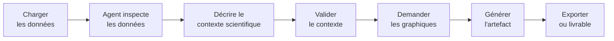
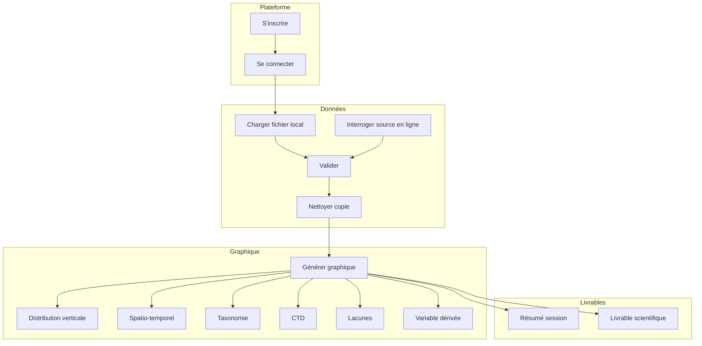

# Assistant graphique copépodes — PRD

| | |
|---|---|
| **Auteur** | Tidiane Cissé |
| **Version** | 1.1 — 2026-05-25 |
| **Statut** |Partiellement Approuvé |
| **Projet** | NeoLab, Université Laval |

---

## À propos de ce document

Ce document décrit les exigences produit de l'assistant graphique copépodes — une readaptation de la plateforme IDEA (Université d'Hawaii) adaptée aux besoins du laboratoire NeoLab (Université Laval).

Il s'adresse à toute personne qui veut comprendre ce que l'assistant fait, pour qui, et selon quelles règles.

---

## Table des matières

1. [Problème](#1-problème)
2. [Solution](#2-solution)
3. [Acteur](#3-acteur)
4. [Vue d'ensemble](#4-vue-densemble)
   - 4.1 [Modes de travail](#41-modes-de-travail)
   - 4.2 [Cycle de vie d'une session](#42-cycle-de-vie-dune-session)
   - 4.3 [Use Cases](#43-use-cases)
5. [Use Cases détaillés](#5-use-cases)
6. [Sources de données](#6-sources-de-données)
7. [Contraintes](#7-contraintes)
8. [Glossaire](#8-glossaire)

---

## Historique des versions

| Version | Date | Description |
|---|---|---|
| 1.0 | 2026-05-25 | Version initiale |
| 1.2 | 2026-06-12 | Alignement avec le runtime IDEA réel : suppression des Modes Contexte/Analyse/En Ligne par source (l'agent est unique, comportement piloté par le system prompt) ; introduction des skills et du workspace SQL ; suppression des UC-02/UC-07/UC-08 et renumérotation ; retrait des contraintes anti-streaming. |
| 1.3 | 2026-06-12 | Durcissement des contraintes CT-AG-06 (validation utilisateur explicite avant opération coûteuse, liste limitative), CT-AG-23 (interdiction explicite « je/moi », format Résultat/Source/Méthode/Limite/Prochaine action) et CT-AG-24 (palette d'incertitude confirmé/exploratoire/incertain, stamp de confiance high/medium/low, alerte rouge si low). |

---

## 1. Problème

L'analyse exploratoire faites par le laboratoire NeoLab peut prendre du temps en raison des nombreuses données historiques possédées par le laboratoire.

Le processus de création de graphiques implique plusieurs étapes, chacune pouvant être source de friction.

---

## 2. Solution

Adapter la plateforme **IDEA** (Université d'Hawaii) aux besoins de NeoLab. Plusieurs choses changent :

1. **Le system prompt** — domaine copépodes, règles de production graphique, sources NeoLab
2. **Le contexte d'utilisation** — Usage dans un contexte de recherche scientifique donc plus de précision dans les réponses
3. **Les outils** — manipulation des données et génération de graphiques pour EcoTaxa, EcoPart, Amundsen CTD, OGSL, Bio-ORACLE et fichiers labo
4. **La documentation** — La documentation que l'agent va devoir utiliser

5. **L'interface utilisateur** — L'interface doit être adaptée pour faciliter l'interaction avec les données et les graphiques

---

## 3. Acteur

**Chercheur NeoLab** — professeur ou étudiant de NeoLab (Université Laval) qui travaille avec des données de copépodes. 

Aucune fonctionnalité n'est réservée à l'un ou l'autre même s'ils auraient des utilisations différentes.

---

## 4. Vue d'ensemble

### 4.1 Pilotage de l'agent

L'assistant est un agent unique de type ReAct (LangGraph). Il n'a pas de « modes » de session : tous les outils sont déclarés à la construction et restent disponibles en permanence. Le comportement — quel outil appeler, dans quel ordre, avec quelles règles — est entièrement dicté par le system prompt copépodes.

Le system prompt distingue deux usages opérationnels :

- **Analyse de fichier** : lecture et calculs sur des données chargées (`load_file`, `run_pandas`, `run_graph`).
- **Base de connaissances** : recherche RAG sur les documents copépodes (`query_copepod_knowledge_base`).

Pour la production graphique, l'agent charge à la demande des **skills** spécialisés (`graph_planner` puis `graph_writer`) qui jouent le rôle d'étape de planification. Pour les sources en ligne, des skills dédiés (`ecotaxa_query`, `bio_oracle_query`, etc.) documentent les règles d'extraction.

### 4.2 Cycle de vie d'une session

```mermaid
flowchart LR
    A[Charger\nles données] --> B[Agent inspecte\nles données]
    B --> C[Décrire le\ncontexte scientifique]
    C --> D[Valider\nle contexte]
    D --> E[Demander\nles graphiques]
    E --> F[Générer\nl'artefact]
    F --> G[Exporter\nou livrable]
```

### 4.3 Use Cases

```mermaid
flowchart TD
    subgraph P[Plateforme]
        UC00[S'inscrire] --> UC01[Se connecter]
    end
    subgraph D[Données]
        UC02[Charger fichier local] --> UC04[Valider]
        UC03[Interroger source en ligne] --> UC04
        UC04 --> UC05[Nettoyer copie]
    end
    subgraph G[Graphique]
        UC06[Générer graphique] --> UC07[Distribution verticale]
        UC06 --> UC08[Spatio-temporel]
        UC06 --> UC09[Taxonomie]
        UC06 --> UC10[CTD]
        UC06 --> UC11[Lacunes]
        UC06 --> UC12[Variable dérivée]
    end
    subgraph L[Livrables]
        UC13[Résumé session]
        UC14[Livrable scientifique]
    end

    UC01 --> UC02
    UC05 --> UC06
    UC06 --> UC13
    UC06 --> UC14
```

---

## 5. Use Cases détaillés

**UC-00 — S'inscrire** : créer un compte sur la plateforme. Hors périmètre de l'agent.

**UC-01 — Se connecter** : accéder à son espace de travail. Hors périmètre de l'agent.

**UC-02 — Charger des données** : déposer un fichier local (CSV, TSV, Excel, JSON, exports EcoTaxa/EcoPart, fichier labo). L'agent appelle `load_file`, qui inspecte automatiquement colonnes, types et valeurs manquantes. Pour les exports UVP, un skill spécialisé (`uvp_ecotaxa`, `uvp_ecopart`) est chargé automatiquement.

**UC-03 — Interroger une source en ligne** : à la demande explicite de l'utilisateur, l'agent appelle un outil de découverte (`list_ecotaxa_projects`, `list_bio_oracle_datasets`, `list_amundsen_datasets`, `list_ecopart_samples`), un outil d'aperçu (`preview_ecotaxa_project`, `preview_bio_oracle_point`, `preview_amundsen_profile`, `preview_ecopart_sample`), puis un outil d'extraction (`query_ecotaxa`, `query_bio_oracle`, `query_amundsen_ctd`, `query_ecopart`). Sources autorisées : EcoTaxa, EcoPart, Amundsen CTD, OGSL, Bio-ORACLE.

**UC-04 — Valider les données chargées** : `load_file` retourne un aperçu — colonnes, types, valeurs manquantes, hints (ex. fichier UVP détecté). Les outils SQL `preview_sql_table` et `list_sql_tables` jouent le même rôle pour les tables d'un serveur SQL.

**UC-05 — Nettoyer les données** : l'agent applique le nettoyage via `run_pandas` sur une copie nommée — jamais sur les données originales. La méthode est annoncée avant exécution.

**UC-06 — Générer un graphique** : l'agent charge `graph_planner` (plan : type, colonnes, filtres, unités), puis `graph_writer` (template de code), puis exécute via `run_graph` (visuel) ou `run_pandas` (tableau). Aucun graphique approximatif si une colonne requise est absente.

**UC-07 — Analyser la distribution verticale** : graphiques de distribution en profondeur depuis EcoTaxa et EcoPart. Nécessite la jointure `obj_orig_id` → `profile_id` pour accéder au volume échantillonné (EcoPart) — orchestrée par `join_ecotaxa_ecopart`. Calcule concentration (ind/m³) ou biovolume par taxon ou stade. Bloqué si le volume échantillonné est absent.

**UC-08 — Analyser la distribution spatio-temporelle** : répartition des observations entre stations et campagnes. Identifie et représente les lacunes géographiques ou temporelles.

**UC-09 — Analyser la taxonomie et les stades** : composition taxonomique et répartition par stades de vie, sur annotations validées (statut V EcoTaxa). Si le statut de validation est absent, l'assistant demande inclusion/exclusion avant de générer.

**UC-10 — Analyser les variables environnementales CTD** : graphiques des variables CTD (température, salinité, oxygène, fluorescence) associées aux données biologiques. La jointure est orchestrée par le skill `environmental_join`, qui documente clé, tolérance temporelle et spatiale, et pertes éventuelles. Priorité Amundsen CTD sur OGSL pour le même besoin.

**UC-11 — Évaluer la complétude et les lacunes** : rapport de remplissage par colonne clé — disponible, partiel, absent. Identifie les variables qui bloquent des analyses spécifiques. Exportable pour demande de subvention.

**UC-12 — Calculer une variable dérivée** : concentration (ind/m³), biomasse carbone (mg C/m²), longueur prosome, indice de plénitude lipidique. La méthode (formule, colonnes, unités, limites) est annoncée avant exécution. Aucun calcul si une colonne obligatoire manque.

**UC-13 — Exporter le résumé de session** : résumé structuré — contexte, sources, méthodes, résultats, limites.

**UC-14 — Préparer un livrable scientifique** : l'agent charge le skill `deliverable_writer` (structure et templates de citation), compile la markdown depuis l'historique, puis appelle `export_deliverable` qui génère un PDF via WeasyPrint. Document structuré avec figures, titres, légendes, méthodes, citations vérifiées et limites. Support de révision pour le chercheur — pas une publication finale.

---

## 6. Sources de données

| Source | Contenu | Accès |
|---|---|---|
| **EcoTaxa** | Taxonomie annotée, objets individuels, morphométrie | Compte requis |
| **EcoPart** | Profils UVP, volumes échantillonnés, CTD associée | Compte requis |
| **Amundsen CTD** | CTD officielle campagne Amundsen via ERDDAP | Public |
| **OGSL** | Profils régionaux golfe du Saint-Laurent | Public |
| **Bio-ORACLE** | Variables environnementales actuelles et futures | Public |
| **Fichier labo** | CSV/Excel fournis par l'utilisateur | Upload direct |

---

## 7. Contraintes

| ID | Règle |
|---|---|
| CT-AG-01 | Toute analyse, graphique ou calcul cite la source de données utilisée. |
| CT-AG-02 | Aucune valeur absente n'est complétée par supposition. |
| CT-AG-03 | Chaque résultat est qualifié : fiable / exploratoire / impossible. |
| CT-AG-04 | Aucune analyse sans contexte validé (espèce, zone, variable, période, source). |
| CT-AG-05 | Les colonnes requises sont vérifiées avant tout calcul. Calcul bloqué si absent. |
| CT-AG-06 | La méthode (colonnes, formule, limites) est soumise pour validation utilisateur explicite avant toute exécution coûteuse : `query_*` complète, calcul de variable dérivée, jointure non standard, `couple_zooplankton_bio_oracle` > 10 lignes, requête SQL sans `LIMIT`, `export_deliverable`. Les opérations légères (load, list, preview, run_pandas sur données déjà chargées, run_graph après plan) restent immédiates. |
| CT-AG-07 | Toute jointure est documentée : clé, tolérance, pertes, qualité du rapprochement. |
| CT-AG-08 | L'assistant communique ce que chaque source permet ou ne permet pas. |
| CT-AG-09 | Le code généré est traçable, visible sur demande, et ses erreurs sont expliquées. |
| CT-AG-10 | Les données brutes ne sont jamais modifiées. Toute transformation crée une copie. |
| CT-AG-11 | Aucun credential n'est affiché, logué ou inclus dans un livrable. |
| CT-AG-12 | Les téléchargements sont proportionnés à la question — pas d'ingestion massive. |
| CT-AG-13 | L'agent ne produit aucune interprétation scientifique ou biologique. |
| CT-AG-14 | Tout graphique inclut titre, axes, unités, source, filtres et limites. |
| CT-AG-15 | Les livrables ne contiennent aucune citation inventée. |
| CT-AG-16 | Périmètre V1 : exploration, validation, graphiques standards, livrables simples. |
| CT-AG-17 | Les paramètres du modèle sont configurés pour la reproductibilité (temperature = 0.0). |
| CT-AG-18 | Réponses courtes et orientées résultat — pas de narration générative. |
| CT-AG-19 | Toute affirmation factuelle est reliée à une source, colonne ou calcul. |
| CT-AG-20 | Chaque résultat inclut l'identifiant de source, les colonnes utilisées et le script. |
| CT-AG-21 | L'assistant vérifie la cohérence entre les sorties et les données sources. |
| CT-AG-22 | Une demande vague ne déclenche pas d'analyse. Un contexte minimal est exigé. |
| CT-AG-23 | Vocabulaire technique et neutre — pas de ton anthropomorphique. Interdiction explicite de « je », « moi », « en tant qu'IA », des compliments, des formules de politesse décoratives. Format Résultat / Source / Méthode / Limite / Prochaine action utilisé pour les résultats analytiques (graphique, calcul, jointure, livrable) ; les questions courtes (un chiffre, un nom de colonne, oui/non, clarification) sont répondues directement sans imposer la structure. |
| CT-AG-24 | Les résultats incertains sont visuellement distincts des résultats confirmés. Trois statuts par ligne : confirmé / exploratoire / identification incertaine. Palette dédiée (saturation pleine vs désaturée vs gris ouvert), hachure pour exploratoire, annotation du niveau de confiance (high / medium / low) imposée sur chaque graphique. Annotation d'alerte rouge si confiance `low`. |
| CT-AG-25 | Les livrables soutiennent la rédaction du chercheur — ils ne la remplacent pas. |
| CT-AG-26 | Les absences dans les données distinguent : absence confirmée, biais d'échantillonnage, incertitude d'identification. |
| CT-AG-27 | L'agent ne révèle, ne devine et ne discute jamais les credentials EcoTaxa, EcoPart, SQL ou tout autre service. |
| CT-AG-28 | L'agent ne fabrique pas de citation scientifique — il dirige vers Google Scholar ou Web of Science si la source vérifiée manque. |
| CT-AG-29 | L'accès SQL est en lecture seule. Les résultats d'une requête SQL sont matérialisés comme copie locale dans le workspace de la conversation. |

---

## 8. Glossaire

| Terme | Définition |
|---|---|
| **IDEA** | Plateforme d'analyse développée à l'Université d'Hawaii (sea-level). Runtime réutilisé pour le profil copépodes NeoLab. |
| **CopepodProfile** | Profil IDEA adapté au domaine copépodes NeoLab : system prompt, outils et RAG remplacés. |
| **EcoTaxa** | Plateforme de classification d'images de zooplancton (UVP5, LOKI, ZooScan). |
| **EcoPart** | Plateforme complémentaire à EcoTaxa : profils UVP, volumes échantillonnés, CTD associée. |
| **CTD** | Conductivity-Temperature-Depth. Instrument de mesure des propriétés physiques de l'eau. |
| **Statut V** | Annotation validée par un humain dans EcoTaxa. Seul statut utilisé pour les graphiques taxonomiques par défaut. |
| **Corpus RAG** | 9 documents de référence : colonnes_sources, colonnes_instruments, colonnes_labo, copepodes_domaine, taxonomie_worms, methodes_calcul, jointures_environnementales, zones_geographiques, sources_en_ligne. |
| **Skill** | Document Markdown chargé à la demande via `load_skill(name)` pour enrichir le contexte de l'agent au moment où une capacité spécialisée devient nécessaire. 11 skills disponibles : `graph_planner`, `graph_writer`, `ecotaxa_query`, `ecopart_query`, `amundsen_ctd_query`, `bio_oracle_query`, `environmental_join`, `sql_workspace_query`, `uvp_ecotaxa`, `uvp_ecopart`, `deliverable_writer`. |
| **Workspace SQL** | Couche d'accès SQL lecture seule (SQLAlchemy) avec matérialisation des résultats comme copies locales dans la conversation. |
| **Artefact** | Fichier produit et sauvegardé par l'assistant (graphique PNG/SVG, table de travail, résumé, PDF de livrable). |
