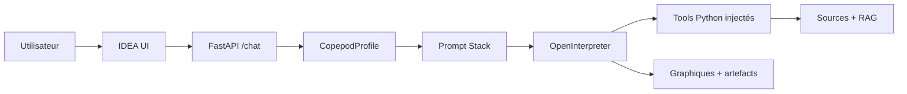
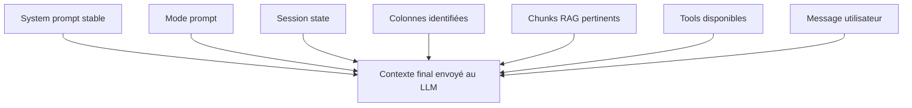
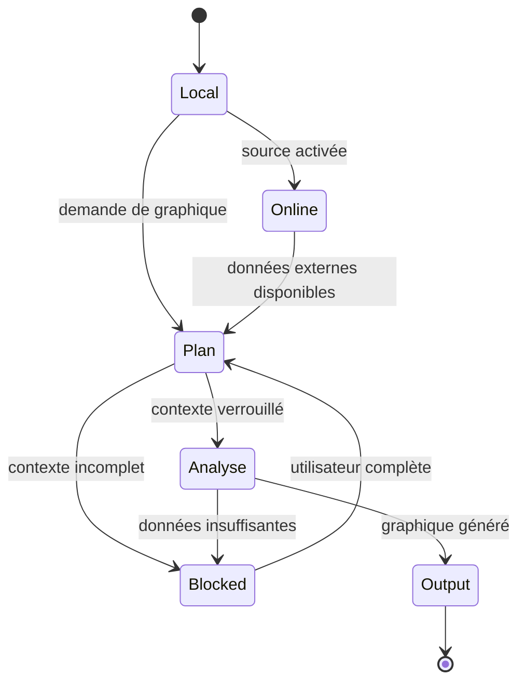
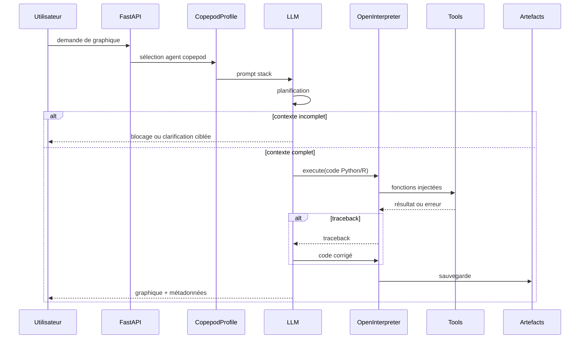
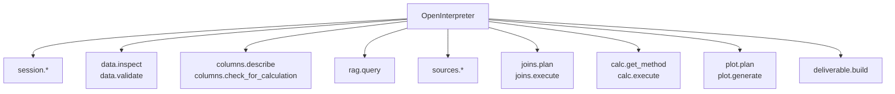

# Architecture — Assistant graphique copépodes

## 1. Intention

L'agent copépodes réutilise le runtime IDEA existant :

- FastAPI ;
- OpenInterpreter ;
- LiteLLM ;
- Langfuse ;
- gestion de session ;
- injection de fonctions Python dans le sandbox.

Ce qui change : l'identité métier, les prompts, les sources, le RAG, les tools et les workflows.

Le but n'est pas de tout mettre dans un system prompt. Le but est de séparer les responsabilités.

---

## 2. Résumé Visuel



**Idée clé :** `CopepodProfile` assemble le bon contexte. OpenInterpreter garde la capacité de générer, exécuter, debugger et relancer du code.

---

## 3. Couches

| Couche | Rôle | Exemple |
|---|---|---|
| Runtime IDEA | Infrastructure inchangée | FastAPI, OpenInterpreter, LiteLLM, Langfuse |
| `CopepodProfile` | Sélectionne prompts, tools et blocs d'instructions | `agent_type="copepod"` |
| System prompt | Règles stables et non négociables | identité, refus, sécurité |
| Mode prompts | Comportement selon l'état | Plan, Analyse |
| Session state | Contexte dynamique | sources activées, colonnes identifiées |
| RAG | Connaissances documentaires | colonnes, méthodes, limites |
| Tool Registry | Fonctions appelables par code | `data.inspect`, `rag.query`, `plot.generate` |
| Artefacts | Sorties persistées | PNG, SVG, HTML, tables dérivées, métadonnées |

---

## 4. Prompt Stack

Le LLM ne reçoit pas un seul bloc monolithique. Il reçoit une pile.



### 4.1 System Prompt

Contient :

- identité : Assistant graphique copépodes ;
- périmètre : graphiques, artefacts, livrables techniques ;
- refus : aucune interprétation scientifique ou biologique ;
- sécurité : secrets jamais exposés ;
- sources autorisées ;
- règles sur données brutes, artefacts, citations, valeurs numériques ;
- rappel que le runtime IDEA/OpenInterpreter reste utilisé.

Ne contient pas :

- colonnes disponibles ;
- chunks RAG longs ;
- signatures détaillées de tools ;
- état de session ;
- logique complète des calculs.

### 4.2 Mode Prompts

Deux prompts principaux :

| Mode | But | Sortie attendue |
|---|---|---|
| Plan | Verrouiller contexte, qualité, sources, colonnes, langage, format | plan structuré ou blocage |
| Analyse | Exécuter le plan validé et produire le graphique | graphique + métadonnées + artefacts |

### 4.3 Blocs Dynamiques

Injectés selon la session :

- sources chargées ;
- sources en ligne activées ;
- colonnes identifiées ;
- contexte scientifique ;
- qualité des données ;
- statut de validation taxonomique ;
- chunks RAG ;
- tools disponibles.

---

## 5. Modes



### 5.1 Mode Local

Utilise uniquement :

- données déjà chargées ;
- colonnes déjà identifiées ;
- RAG local.

Aucune requête externe.

### 5.2 Mode En Ligne

Activé **par source**.

Sources autorisées :

- EcoTaxa ;
- EcoPart ;
- Amundsen CTD ;
- OGSL ;
- Bio-ORACLE.

OBIS est exclu du prompt cible.

Si une source n'est pas activée, l'agent signale le blocage et ne lance pas de requête.

### 5.3 Mode Plan

Vérifie :

- objectif graphique ;
- taxon ou espèce si pertinent ;
- zone ;
- période ;
- variable d'intérêt ;
- type de graphique ;
- sources ;
- colonnes ;
- filtres ;
- unités ;
- qualité ;
- statut de validation ;
- jointures ;
- langage Python ou R ;
- format de sortie ;
- artefacts à sauvegarder.

### 5.4 Mode Analyse

Exécute le plan :

- prépare une table de travail ;
- ne modifie jamais les données brutes ;
- génère le graphique ;
- sauvegarde l'artefact ;
- sauvegarde les métadonnées ;
- répond sans interprétation.

---

## 6. Cycle Utilisateur



Le debug est donc conservé : le LLM peut lire une erreur, corriger son code et relancer.

---

## 7. Sources

| Source | Usage | Règle |
|---|---|---|
| EcoTaxa | taxonomie, images, morphométrie objet | vérifier validation humaine |
| EcoPart | profils UVP, profondeur, volume, particules | utile pour concentrations |
| Amundsen CTD | CTD officielle campagne/navire | priorité sur OGSL si les deux couvrent le besoin |
| Données labo | fichiers utilisateur : lipides, biomasse, comptages | structure inconnue avant inspection |
| OGSL | profils et données régionales golfe du Saint-Laurent | source complémentaire régionale |
| Bio-ORACLE | conditions environnementales actuelles/futures | pas une source taxonomique |

---

## 8. RAG

| Document | Rôle |
|---|---|
| `colonnes_sources.md` | sources, identifiants, accès, jointures |
| `colonnes_instruments.md` | définitions de colonnes |
| `copepodes_domaine.md` | taxons, périmètre, avertissements d'identification |
| `methodes_calcul.md` | formules, variables dérivées, unités, limites |
| `sources_en_ligne.md` | accès et limites des sources, à réviser pour OGSL/Bio-ORACLE sans OBIS |

Le RAG est cité quand il justifie :

- une définition ;
- une méthode ;
- une limite technique ;
- une référence bibliographique.

---

## 9. Tools Cibles



Les signatures détaillées restent dans les specs et le Tool Registry. Le system prompt ne doit pas les dupliquer.

---

## 10. Workflows / Skills Candidats

| Workflow | Rôle |
|---|---|
| `plan-graph` | produire un plan graphique complet |
| `check-taxonomy-validation` | gérer validé / non validé / inconnu |
| `activate-online-source` | cadrer l'accès par source |
| `generate-graph` | générer et sauvegarder le graphique |
| `couple-biooracle` | coupler zooplancton et conditions futures |
| `build-technical-deliverable` | livrable technique sans interprétation |

Critère de choix :

- **Skill** : procédure multi-étapes réutilisable.
- **Instruction block** : contexte ou règle injectée selon l'état.
- **Tool** : fonction déterministe appelée par code.

---

## 11. Formats De Réponse

### Graphique Produit

```markdown
### Graphique produit
[affichage ou lien vers l'artefact]

### Métadonnées
- Source :
- Colonnes :
- Filtres :
- Unités :
- Méthode :
- Qualité / limites :
```

### Graphique Non Généré

```markdown
### Graphique non généré
- Demande :
- Blocage :
- Données/colonnes requises :
- Données/colonnes disponibles :
- Action nécessaire :
```

### Refus D'Interprétation

```markdown
Je ne peux pas fournir d'interprétation scientifique ou biologique.
Je peux uniquement produire des graphiques, métadonnées techniques,
limites de qualité et livrables techniques pour révision humaine.
```

---

## 12. Invariants À Tester

- `CopepodProfile` existe.
- `CopepodProfile.agent_type == "copepod"`.
- Le profil est importé au bootstrap IDEA.
- Le prompt contient EcoTaxa, EcoPart, Amundsen CTD, données labo, OGSL, Bio-ORACLE.
- Le prompt ne présente pas OBIS comme source autorisée.
- Le prompt retire le domaine sea-level/UHSLC/stations/datums/climate-index.
- Le prompt interdit l'interprétation scientifique et biologique.
- Le prompt exige `execute` pour le code à exécuter.
- Le prompt interdit la modification des données brutes.
- Le prompt exige la sauvegarde des graphiques.
- Le prompt protège credentials, tokens et variables d'environnement.
- Le prompt impose une décision utilisateur si validation taxonomique inconnue ou non confirmée.

---

## 13. Premier Incrément

Implémenter uniquement :

1. `CopepodProfile`.
2. Prompt copépodes minimal en couches.
3. Import bootstrap dans IDEA.
4. Tests structurels du profil et du prompt.

Hors premier incrément :

- implémentation complète du RAG ;
- tools sources en ligne ;
- génération réelle des graphiques ;
- skills complets.
